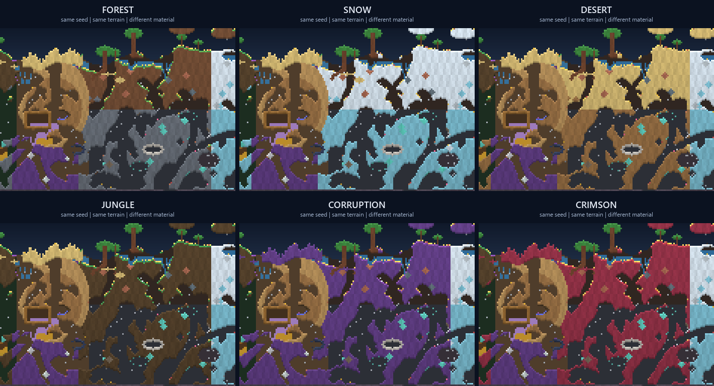

<p align="center">
  
</p>

<h1 align="center">TerraForge</h1>

<p align="center">
  A deterministic 2D world forge inspired by Terraria's public generation concepts.
</p>

<p align="center">
  <a href="https://github.com/IsolatedSingularity/Terraria-Generation/actions/workflows/ci.yml"></a>
  
  <a href="LICENSE"></a>
</p>


TerraForge takes a seed and builds a complete tile world that can be watched,
inspected, rendered, and exported. Terrain, walls, liquids, biomes, landmarks,
and generation notes remain separate, so the result is useful as both a map
and a small procedural-generation laboratory.

> The Guide was unavailable, so the machine learned to grow its own forests.

The generator is an independent educational project. It uses original Python
code and original art, does not read or write Terraria ".wld" files, and does
not include Re-Logic sprites or private game code.

## Light the forge

Python 3.11 or newer is required. Tkinter ships with standard Windows Python;
some Linux distributions provide it separately as `python3-tk`.

```bash
git clone https://github.com/IsolatedSingularity/Terraria-Generation.git
cd Terraria-Generation
python -m pip install -e .
python -m terraforge gui
```

A world can also be made without opening the desktop app:

```bash
terraforge generate --seed "mechanical-tree" --evil crimson --hardmode \
  --png world.png --npz world.npz --json world.json --gif generation.gif
```

Windows builds use `./scripts/build_windows.ps1` and produce
`dist/TerraForge.exe`.

## The workshop


The desktop app keeps generation, exploration, and export in one place. Choose
a seed, world size, evil biome, difficulty, and phase set; then pan and zoom the
result, inspect individual tiles, compare it with the previous world, or export
PNG, GIF, and compressed NumPy data. Generation runs away from the Tk event
loop, so the window stays responsive and the active forge can be quenched
between passes.

Preview worlds are deliberately quick to explore. Small worlds use the full
`4200 x 1200` grid and are an explicit choice.

## Three seeds, three destinies


Corruption cuts violet scars through stone, Crimson answers in red, and
Hardmode drives Hallow and evil through the world in a great V. The third panel
is not a recolor. It is a separate world after TerraForge's optional Hardmode
transformation.

The Dryad would have opinions about all three. The machine records the tile
counts and keeps working.

## What grows underground


A seed can raise oceans, forests, snowfields, desert, and Jungle above a
stack of tunnels, chambers, ore veins, and underground biomes. Floating
Islands wait above the treeline. Living Trees send roots into the soil, while
a Pyramid may sit beneath sand that looked perfectly innocent from the
surface.

The Dungeon claims one coast and descends through rooms and corridors. Deeper
still, the Jungle can hide honey-filled Hives and a sealed Temple. Spider
caves, gem caves, traps, pots, altars, Life Crystals, and an Aether pocket give
the Caverns reasons to carry more torches than seemed sensible at spawn.


Landmark symbols are original map marks, not borrowed sprites. The renderer
gives materials deterministic texture, connected-edge shading, depth lighting,
and liquid blending. There are no ripped tilesheets hiding behind the walls.

## One patch of earth, six possible biomes



This study freezes the seed, caves, surface profile, and camera. Only the
material identity changes. Snow seals the same cavities in ice, Desert turns
them to sandstone, Jungle packs them with mud, and the two evil biomes disagree
about the proper color for a chasm. It is a compact view of how biome rules can
change a place without changing its underlying geometry.

## The long way down


The depth gauge follows one world from daylight through the Underground and
Caverns to the Underworld. It is the same map throughout the loop, not a stack
of unrelated screenshots. Layer boundaries come from the world model, so the
instrument agrees with the GUI tile probe.

A new character might arrive with a copper pickaxe and confidence. TerraForge
supplies the darkness, suspicious pressure plates, and the long walk home.

## Field notes from the workshop

### Above the dirt

Spawn is placed near the middle of the world, but safety is never guaranteed.
Oceans close the map at both ends, Floating Islands occupy the sky, and surface
biomes compete for room between them. Trees and flowers arrive late in the
pipeline, after the ground has decided where it wants to be.

### Where torches earn their keep

The Underground gives way to the Caverns, walls can coexist with empty tiles,
and liquids keep both an amount and a kind. Water, lava, honey, and Shimmer are
therefore not painted colors. They are world state. The Aether is rare by
design; finding its marker should still feel like noticing something the map
was trying to keep quiet.

### When the old world cracks

TerraForge does not stage the Wall of Flesh fight. Selecting Hardmode begins
after that story beat and carves the familiar opposing V of Hallow and evil
through the generated world. It is an optional post-generation event, which
means the untouched pre-Hardmode world can still be compared with what came
after.

Seeds are strings on purpose. Familiar names such as `not-the-bees`,
`for-the-worthy`, or `05162020` are valid inputs, but they remain ordinary
TerraForge seeds. No secret-world rules are copied from the game. The Goblin
Tinkerer would probably call that a missing feature and charge to reforge it.

## World data

```python
from terraforge import Evil, WorldConfig, generate_world

world = generate_world(
    WorldConfig(seed="TerraForge", evil=Evil.CRIMSON, hardmode=True)
)

print(world.tiles.shape)                 # (140, 240) in Preview mode
print(world.metadata["selected_ores"])

# Separate arrays allow walls and liquids to coexist with empty tiles.
tiles = world.tiles                      # uint8
walls = world.walls                      # uint8
liquid_amount = world.liquid_amount      # uint8
liquid_kind = world.liquid_kind          # uint8
biomes = world.biomes                    # uint8
surface_height = world.surface           # int16
```

Every random decision derives from the project seed and a stable pass label.
Changing one generation handler therefore does not quietly reshuffle every
later decision.

## Inside the machine

```text
WorldConfig
    -> TerraForgePipeline
        -> isolated random stream for each named pass
            -> tiles, walls, liquids, biomes, metadata, landmarks
                -> desktop app | CLI | PNG/GIF | NPZ/JSON
```

The supported package lives in `terraforge/`. Its boundaries and invariants are
documented in [the architecture guide](docs/ARCHITECTURE.md). The complete pass
inventory remains available in [the generation notes](docs/FIDELITY.md) for
contributors who need it, but it is not part of the sales pitch.

`Engine/`, `Code/`, and `Advanced/` are a labeled research archive. They are
not included in the runtime package.

## Development

```bash
python -m pip install -e ".[dev,build]"
ruff check terraforge tests scripts packaging
ruff format --check terraforge tests scripts packaging
mypy terraforge
pytest --cov=terraforge
python -m build
```

Tracked world media and icon derivatives are reproducible:

```bash
python -m scripts.generate_media
python -m scripts.capture_gui  # requires a visible desktop
```

CI covers Python 3.11, 3.12, and 3.13 on Windows and Ubuntu. Contributor and
release details live in [CONTRIBUTING.md](CONTRIBUTING.md) and
[CHANGELOG.md](CHANGELOG.md).

## Notes from older worlds

The repository began as a set of procedural-generation experiments. These
three teaching diagrams remain useful, even though new work belongs in the
supported package.

| Surface noise | Cave smoothing | Ore distribution |
|---|---|---|
|  |  |  |

## Legal

TerraForge is not affiliated with, endorsed by, or sponsored by Re-Logic.
Terraria and its related names and assets belong to their respective owners.
TerraForge code and original project assets are available under the
[MIT License](LICENSE). The supplied tree reference is not distributed as a
runtime asset.
