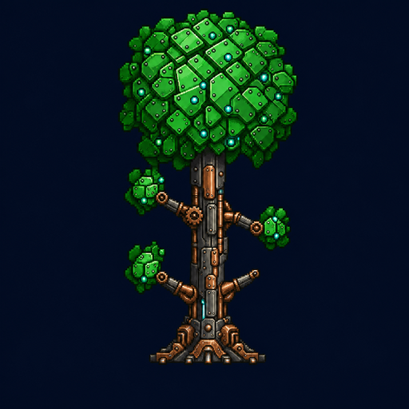
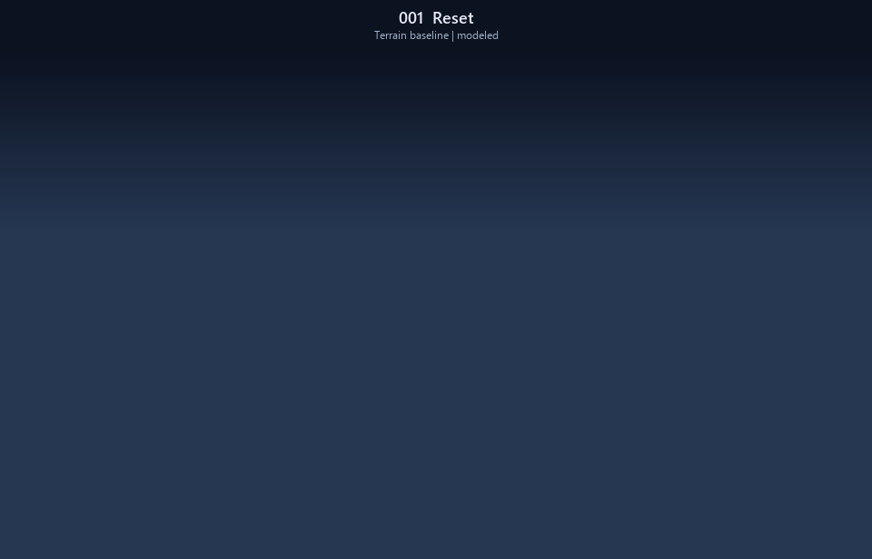
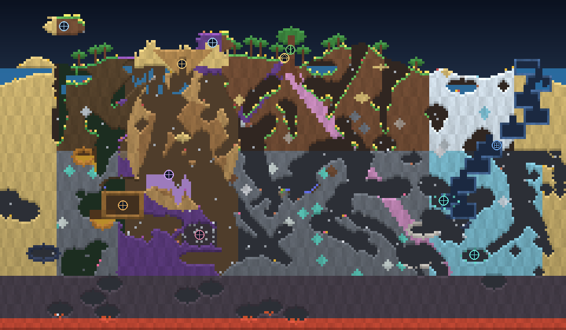

<p align="center">
  
</p>

<h1 align="center">TerraForge</h1>

<p align="center">
  A deterministic 2D world forge inspired by Terraria's public generation concepts.
</p>

<p align="center">
  <a href="https://github.com/IsolatedSingularity/Terraria-Generation/actions/workflows/ci.yml"></a>
  
  <a href="LICENSE"></a>
</p>



TerraForge takes a seed and builds a complete tile world that can be watched,
inspected, rendered, and exported. Terrain, walls, liquids, biomes, landmarks,
and generation notes remain separate, so the result is useful as both a map
and a small procedural-generation laboratory.

> The Guide was unavailable, so the machine learned to grow its own forests.

The generator is an independent educational project. It uses original Python
code and original art, does not read or write Terraria ".wld" files, and does
not include Re-Logic sprites or private game code.

## Light the forge

Python 3.11 or newer is required. Tkinter ships with standard Windows Python;
some Linux distributions provide it separately as `python3-tk`.

```bash
git clone https://github.com/IsolatedSingularity/Terraria-Generation.git
cd Terraria-Generation
python -m pip install -e .
python -m terraforge gui
```

A world can also be made without opening the desktop app:

```bash
terraforge generate --seed "mechanical-tree" --evil crimson --hardmode \
  --png world.png --npz world.npz --json world.json --gif generation.gif
```

Windows builds use `./scripts/build_windows.ps1` and produce
`dist/TerraForge.exe`.

## The workshop


The desktop app keeps generation, exploration, and export in one place. Choose
a seed, world size, evil biome, difficulty, and phase set; then pan and zoom the
result, inspect individual tiles, compare it with the previous world, or export
PNG, GIF, and compressed NumPy data. Generation runs away from the Tk event
loop, so the window stays responsive and the active forge can be quenched
between passes.

Preview worlds are deliberately quick to explore. Small worlds use the full
`4200 x 1200` grid and are an explicit choice.

## What grows underground



A seed can produce Corruption or Crimson, alternate ore sets, surface biomes,
layered cave networks, oceans, a room-based Dungeon, Living Trees, Hives,
Shimmer, a Jungle Temple, and an optional Hardmode transformation. These are
original approximations of familiar world-generation ideas, not attempts to
reproduce a Terraria world tile for tile.


The renderer gives materials deterministic texture, connected-edge shading,
depth lighting, liquid blending, and compact geometric landmarks. There are no
ripped tilesheets hiding in the workshop.

Seeds are strings on purpose. Familiar names such as `not-the-bees`,
`for-the-worthy`, or `05162020` are valid inputs, but they remain ordinary
TerraForge seeds. No secret world behavior is borrowed from the game. The
Goblin Tinkerer would probably charge extra for that.

## World data

```python
from terraforge import Evil, WorldConfig, generate_world

world = generate_world(
    WorldConfig(seed="TerraForge", evil=Evil.CRIMSON, hardmode=True)
)

print(world.tiles.shape)                 # (140, 240) in Preview mode
print(world.metadata["selected_ores"])

# Separate arrays allow walls and liquids to coexist with empty tiles.
tiles = world.tiles                      # uint8
walls = world.walls                      # uint8
liquid_amount = world.liquid_amount      # uint8
liquid_kind = world.liquid_kind          # uint8
biomes = world.biomes                    # uint8
surface_height = world.surface           # int16
```

Every random decision derives from the project seed and a stable pass label.
Changing one generation handler therefore does not quietly reshuffle every
later decision.

## Inside the machine

```text
WorldConfig
    -> TerraForgePipeline
        -> isolated random stream for each named pass
            -> tiles, walls, liquids, biomes, metadata, landmarks
                -> desktop app | CLI | PNG/GIF | NPZ/JSON
```

The supported package lives in `terraforge/`. Its boundaries and invariants are
documented in [the architecture guide](docs/ARCHITECTURE.md). The complete pass
inventory remains available in [the generation notes](docs/FIDELITY.md) for
contributors who need it, but it is not part of the sales pitch.

`Engine/`, `Code/`, and `Advanced/` are a labeled research archive. They are
not included in the runtime package.

## Development

```bash
python -m pip install -e ".[dev,build]"
ruff check terraforge tests scripts packaging
ruff format --check terraforge tests scripts packaging
mypy terraforge
pytest --cov=terraforge
python -m build
```

Tracked world media and icon derivatives are reproducible:

```bash
python -m scripts.generate_media
python -m scripts.capture_gui  # requires a visible desktop
```

CI covers Python 3.11, 3.12, and 3.13 on Windows and Ubuntu. Contributor and
release details live in [CONTRIBUTING.md](CONTRIBUTING.md) and
[CHANGELOG.md](CHANGELOG.md).

## Notes from older worlds

The repository began as a set of procedural-generation experiments. These
three teaching diagrams remain useful, even though new work belongs in the
supported package.

| Surface noise | Cave smoothing | Ore distribution |
|---|---|---|
|  |  |  |

## Legal

TerraForge is not affiliated with, endorsed by, or sponsored by Re-Logic.
Terraria and its related names and assets belong to their respective owners.
TerraForge code and original project assets are available under the
[MIT License](LICENSE). The supplied tree reference is not distributed as a
runtime asset.
