# Terraria World Generation

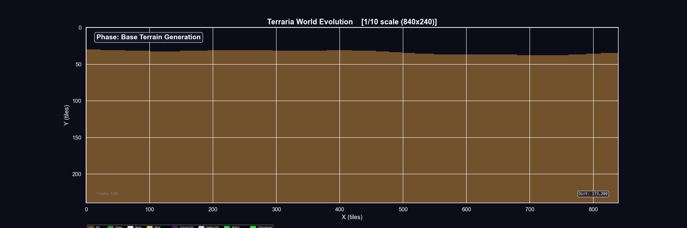

[](https://www.python.org/)
[](https://matplotlib.org/)
[](https://numpy.org/)
[](https://seaborn.pydata.org/)
[](https://scipy.org/)

## Overview

A faithful Python reimplementation of Terraria's **103-pass world generation pipeline**, derived from decompiled `WorldGen.cs` source analysis. The project provides an `Engine/` core library of game-accurate algorithms and constants, plus visualization scripts that produce dark-themed publication-quality plots and animations.

Key algorithms reproduced:

- **TileRunner** diamond-brush random walk (cave carving, ore veins, biome conversion)
- **Cellular automata smoothing** for organic cave edges
- **Gravity-based liquid settling** with water/lava/honey interaction rules
- **Tile update cycle infection spread** with surface vs underground rates and air gap blocking
- **StructureMap exclusion zones** for conflict-free placement
- **Dungeon eating algorithm** with interlocking rooms

## Visualizations

### Surface Terrain

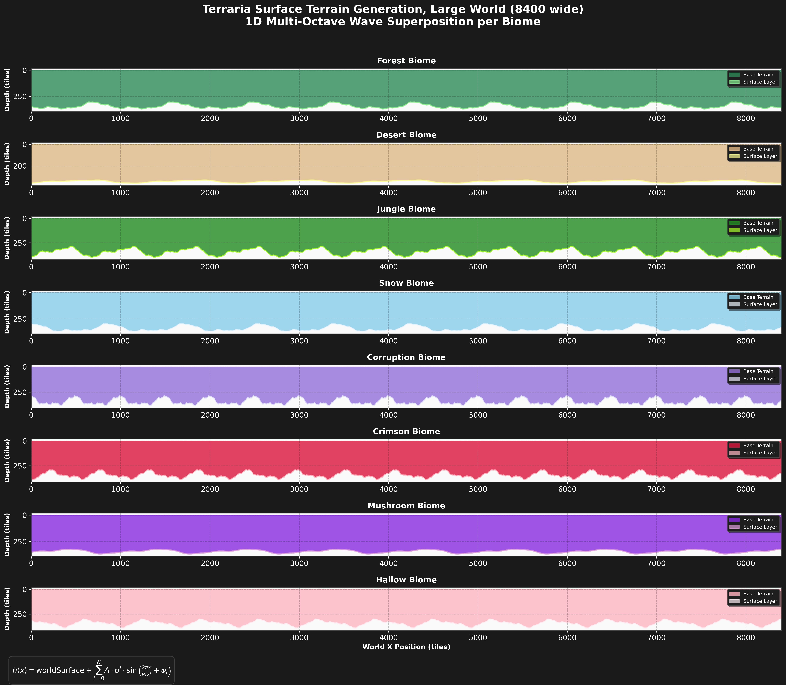

Multi-octave sine noise terrain generation showing individual frequency components, composite waveform, and tile-grid rendering. Each biome type uses distinct noise parameters.

### Cave Systems

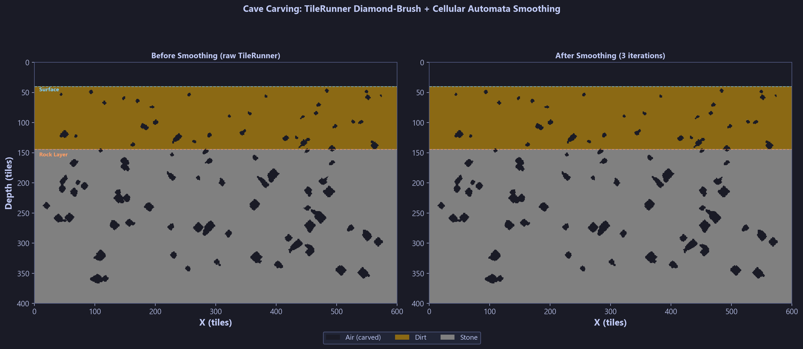

TileRunner-based cave carving with depth-dependent density. Surface caves use smaller strength (4-8) and fewer steps; rock-layer caves use strength 10-22 with up to 100 steps. Cellular automata smoothing rounds cave edges.

### Biome Distribution

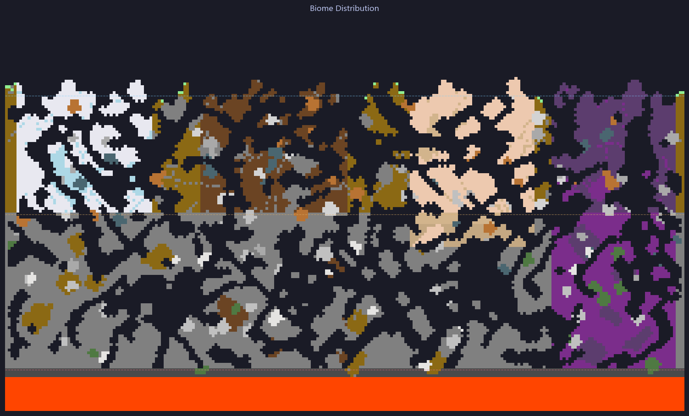

Large world biome placement following game rules:

- Jungle always opposite the Dungeon side
- Snow biome on the same side as the Dungeon
- Evil biome placed independently (either hemisphere)
- 1 surface Desert + 1 Underground Desert (circular ant-hive)
- 6 Floating Islands, 16-32 Marble caves, similar Granite caves
- Underground Mushroom biome in the cavern layer
- 45-tile border buffer on all edges

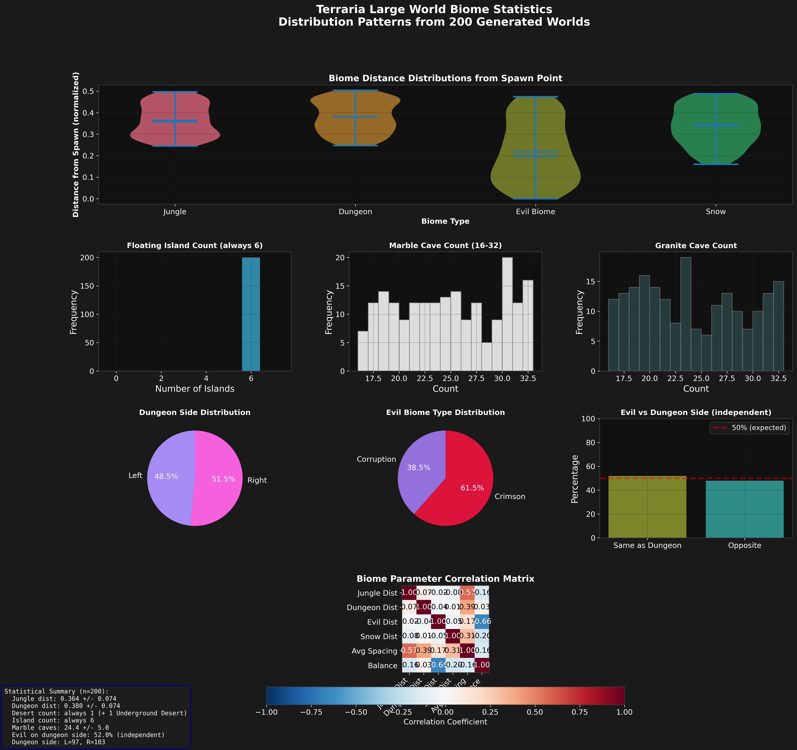

Statistical analysis of 200 generated worlds showing distance distributions, side independence, and correlation matrices.

### Biome Tile Conversion

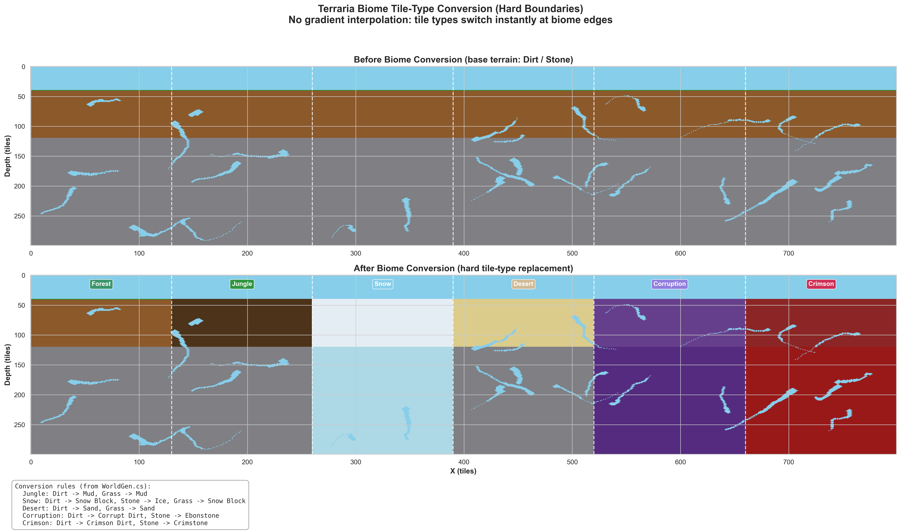

Side-by-side tile-grid visualization of biome conversion rules: Snow (dirt to snow/ice), Jungle (dirt to mud), Corruption (stone to ebonstone, dirt to corrupt dirt).

### Ore Distribution

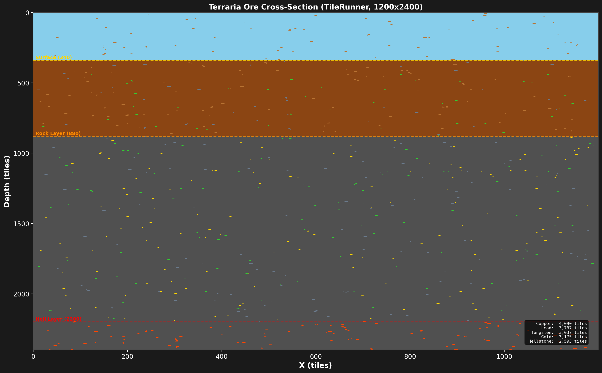

Depth-based ore placement using the game's `int(area * 6E-05)` vein count formula. Pre-hardmode ores use alternating pair selection (Copper/Tin, Iron/Lead, Silver/Tungsten, Gold/Platinum). Each vein is placed by TileRunner with `overRide=False`.

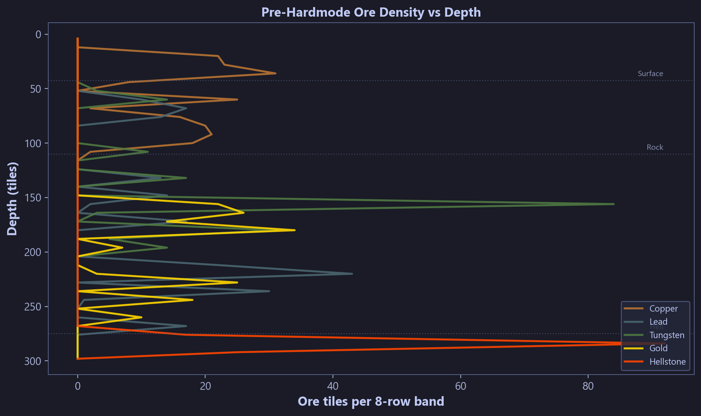

Depth-density profiles showing tile counts per row, with layer boundary markers.

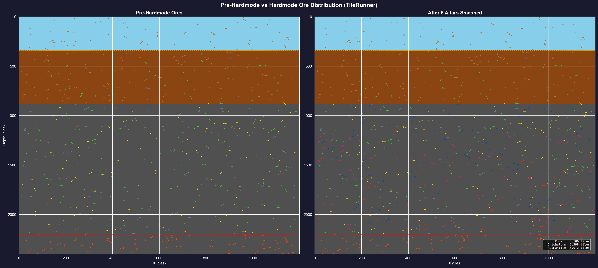

Hardmode ore generation via the 3-cycle altar-smashing system (Cobalt/Palladium, Mythril/Orichalcum, Adamantite/Titanium).

### Structure Placement

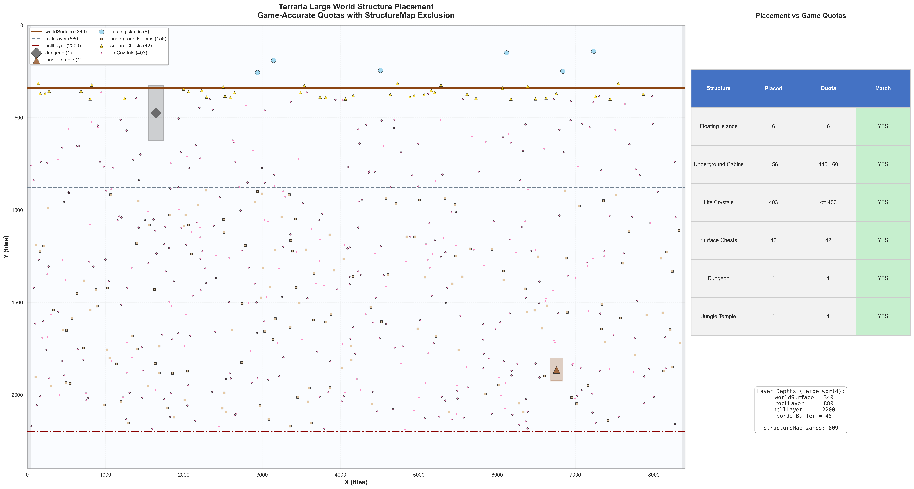

Game-accurate structure quotas with StructureMap exclusion zones: 6 Floating Islands, 140-160 Underground Cabins, up to 403 Life Crystals, 42 Surface Chests, 1 Dungeon, 1 Jungle Temple. Includes statistics table comparing placed counts to game quotas.

### Liquid Physics

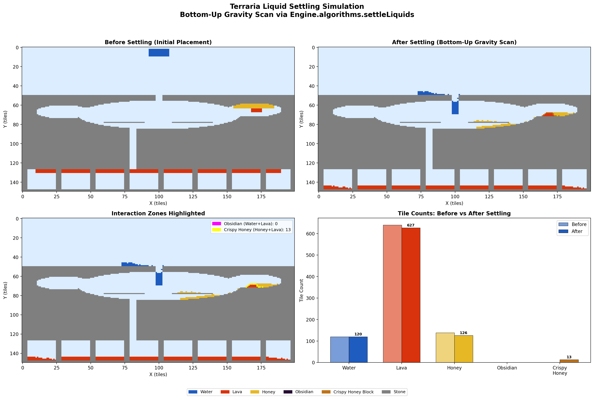

Gravity-based liquid settling simulation showing water, lava, and honey behavior with obsidian and crispy honey block formation at contact boundaries.

## Advanced Simulations

### 23-Pass World Generation Pipeline

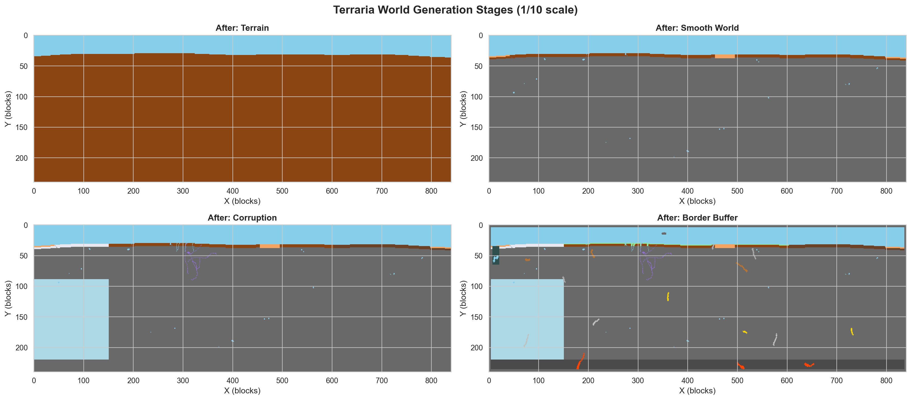

Key milestones from the 23-pass pipeline at 1/10 scale (840x240). Passes include: Reset, Terrain, Stone Layer, Sand Patches, Rocks In Dirt, Dirt In Rocks, Clay, Silt, Surface Caves, Dirt Layer Caves, Rock Layer Caves, Smooth World, Snow Biome, Jungle, Corruption, Floating Islands, Underworld, Shinies, Dungeon, Settle Liquids, Life Crystals, Grass, Border Buffer.

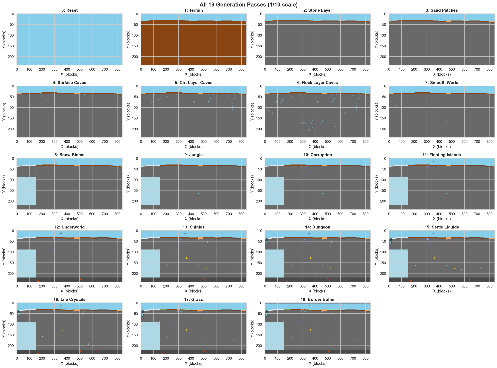

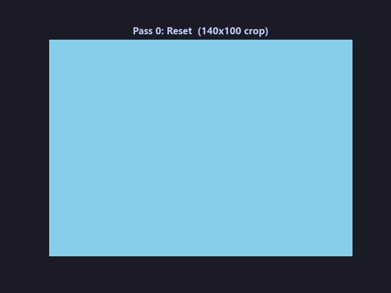

### Corruption/Crimson/Hallow Evolution

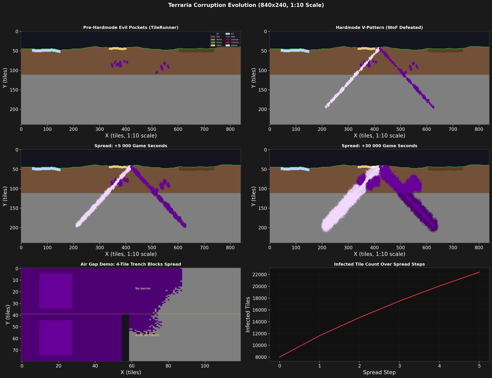

Full infection lifecycle: pre-hardmode evil pockets via TileRunner, hardmode V-pattern diagonal carving, tile-update-cycle spread with asymmetric surface/underground rates (`SURFACE_UPDATE_RATE=140s`, `UNDERGROUND_UPDATE_RATE=830s`), and air gap blocking demonstration (`INFECTION_GAP_TILES=4`).

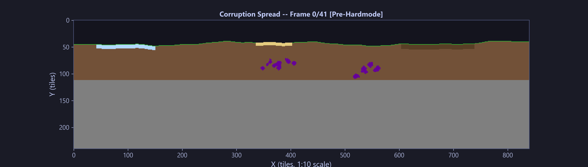

### Complete World Evolution

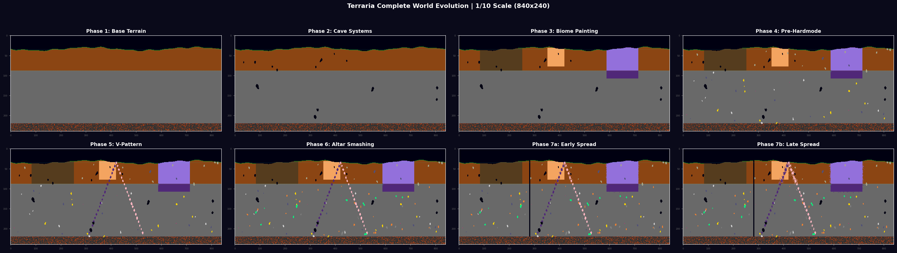

Seven-phase lifecycle from empty grid to late Hardmode: base terrain, cave systems, biome painting, pre-HM ores + Life Crystals, V-pattern, altar-smashing HM ores, infection spread with radius-3 neighbor sampling and air gap blocking.

### Hardmode Transformation

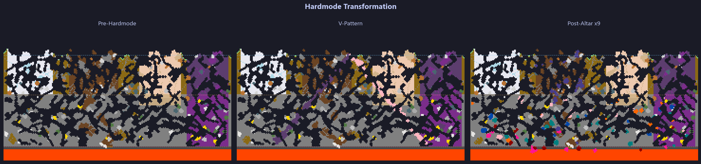

Detailed hardmode mechanics: 3-cycle ore generation (Cobalt/Palladium tier 1, Mythril/Orichalcum tier 2, Adamantite/Titanium tier 3), Chlorophyte growth in jungle cavern, and biome conversion visualization.

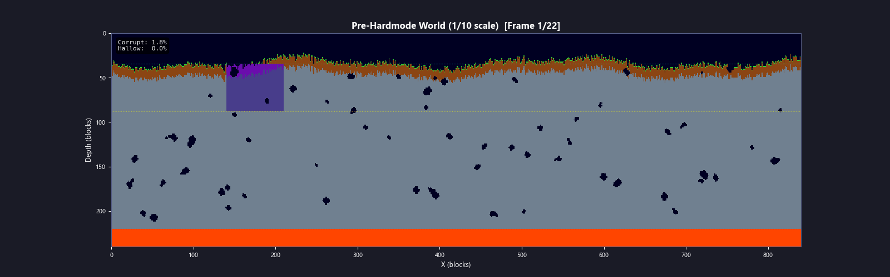

### Master Evolution


Complete 26-frame animation covering all 10 phases: world generation (23 passes), corruption initial state, hardmode V-pattern, altar smashing, infection spread, and Chlorophyte growth.

## Architecture

```
Engine/                              # Core library
    __init__.py
    algorithms.py                    # tileRunner, digTunnel, cavinator, cellularAutomataSmooth (vectorized), settleLiquids (seeded RNG)
    constants.py                     # WorldSize, LayerDepths, StructureQuotas, OreConfig, unified tile/wall IDs
    structures.py                    # 12 structure generators + 8 placement passes, vectorized spreadGrass
    structureMap.py                  # Rectangle + StructureMap exclusion zones
    theme.py                         # Unified dark theme, COLORS, BIOME_COLORS, TILE_COLORS, ORE_COLORS, seqCmap/divCmap/lightCmap
Code/                                # Visualization scripts
    terrariaBiomeAnalysis.py         # Biome layout + statistics (200-sample analysis)
    terrariaNoiseSystems.py          # Surface terrain + cave systems + tile conversion
    terrariaOreDistribution.py       # Ore cross-section + density + HM comparison
    terrariaStructureGeneration.py   # StructureMap placement + quota validation
    Excess/
        terrariaLiquidPhysics.py     # Liquid settling simulation
Advanced/                            # Full-scale simulations
    terrariaWorldGeneration.py       # 23-pass pipeline with animation
    terrariaCompleteWorldEvolution.py # 7-phase lifecycle (840x240)
    terrariaCorruptionEvolution.py   # Infection spread + air gap demo
    terrariaHardmodeStructures.py    # HM ore + Chlorophyte
    terrariaHardmodeDetailedAnimation.py # HM animation
    terrariaMasterEvolution.py       # 26-frame master GIF
Plots/                               # Generated output (19 files)
    Advanced/                        # Advanced simulation outputs
    Excess/                          # Liquid physics output
References/                          # Research documentation
```

## Setup

```bash
git clone https://github.com/IsolatedSingularity/Terraria-Generation
cd Terraria-Generation
pip install -e .          # editable install (Engine becomes importable)
```

> `pip install -e .` uses the `[build-system]` in `pyproject.toml` to expose the `Engine/` package. If you only need the dependencies, `pip install -r requirements.txt` works too.

### Generate All Plots

```bash
# Code/ visualizations
python Code/terrariaBiomeAnalysis.py
python Code/terrariaNoiseSystems.py
python Code/terrariaOreDistribution.py
python Code/terrariaStructureGeneration.py
python Code/Excess/terrariaLiquidPhysics.py

# Advanced simulations
python Advanced/terrariaWorldGeneration.py
python Advanced/terrariaCompleteWorldEvolution.py
python Advanced/terrariaCorruptionEvolution.py
python Advanced/terrariaHardmodeStructures.py
python Advanced/terrariaHardmodeDetailedAnimation.py
python Advanced/terrariaMasterEvolution.py
```

## Key Formulas

**Ore vein count**: `int(worldArea * 6E-05)` per ore type

**TileRunner diamond brush**: Carves/places tiles in a diamond shape of radius `strength` at each step, random-walking `steps` times. All algorithms use `np.random.default_rng(seed)` for full reproducibility.

**Infection spread**: Each tile update cycle, infected tiles pick one random neighbor within radius `INFECTION_SPREAD_RADIUS` (3 tiles). Conversion is blocked by `INFECTION_GAP_TILES` (4) consecutive air tiles on the path.

**Layer depths** (large world, 8400x2400): `worldSurface=340`, `rockLayer=880`, `hellLayer=2200`.

## References

- Decompiled `WorldGen.cs` from Terraria source (Re-Logic)
- Perlin, K. (1985). "An Image Synthesizer". Computer Graphics, 19(3), 287-296
- See [References/worldgen-research.md](References/worldgen-research.md) for full research notes

## License

MIT License. All Terraria-related content and mechanics are owned by Re-Logic.
