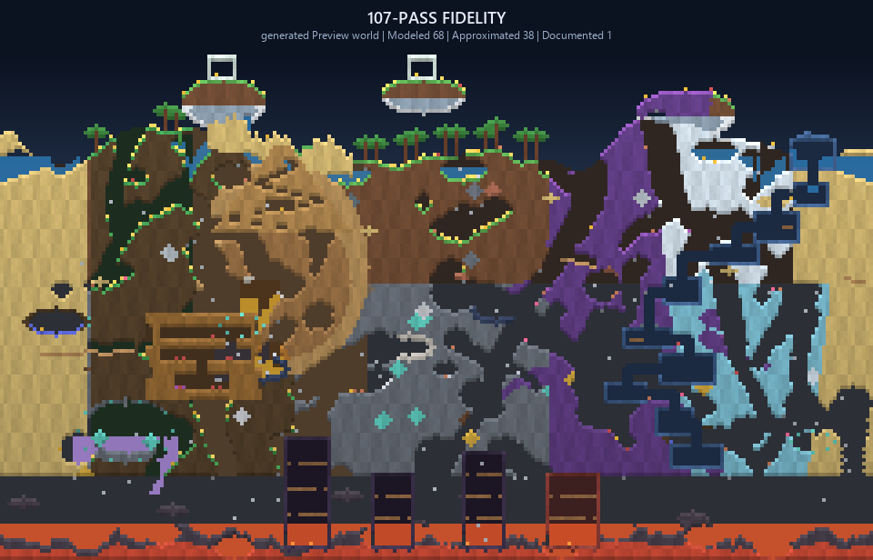

<p align="center">
  
</p>

<h1 align="center">TerraForge</h1>

<p align="center">
  A deterministic, inspectable 2D world-generation laboratory inspired by Terraria's public generation concepts.
</p>

<p align="center">
  <a href="https://github.com/IsolatedSingularity/Terraria-Generation/actions/workflows/ci.yml"></a>
  
  
  <a href="LICENSE"></a>
</p>


TerraForge turns a seed into separate NumPy arrays for tiles, walls, liquids,
biomes, and metadata. Its named pipeline follows the publicly documented
Terraria 1.4.4.9 vanilla ordering while using independent Python
implementations and original art.

This is an educational simulator. It does not read or write Terraria `.wld`
files, include Re-Logic assets, or claim seed-for-seed or source compatibility.


## Highlights

- One canonical registry for 51 tile types, 10 wall states, four liquids, and
  13 biome states.
- A reproducible 107-pass pipeline with independent per-pass RNG streams,
  progress events, timing, cooperative cancellation, snapshots, and optional
  phase controls.
- Meaningfully different Corruption and Crimson layouts, a post-generation
  Hallow/evil V, biome-specific caves, alternate ore selection, a room-based
  Dungeon, Living Trees, Shimmer, a Jungle Temple, Hives, and other structures.
- Preview (`240 x 140`) and genuine Small (`4200 x 1200`) simulation sizes.
- A lightweight Tk desktop app with seed/world controls, overlays, zoom/pan,
  tile inspection, current/previous split comparison, pass telemetry, dark and
  light interfaces, and PNG/GIF/NumPy exports.
- A source-install CLI, reproducible media generator, PyInstaller Windows
  build, Windows/Ubuntu CI matrix, and tagged Windows release workflow.

## Quick start

Python 3.11 or newer is required. Tkinter ships with standard Windows Python;
some Linux distributions package it separately as `python3-tk`.

```bash
git clone https://github.com/IsolatedSingularity/Terraria-Generation.git
cd Terraria-Generation
python -m pip install -e .
python -m terraforge gui
```

Generate and export a world from the terminal:

```bash
terraforge generate --seed "mechanical-tree" --evil crimson --hardmode \
  --png world.png --npz world.npz --json world.json --gif generation.gif

terraforge passes
terraforge benchmark --scale preview --iterations 7
```

Tagged releases can include a standalone `TerraForge.exe`. To build it locally
on Windows:

```powershell
./scripts/build_windows.ps1
./dist/TerraForge.exe
```

## Native desktop workflow

The GUI starts with an explicit, fast Preview generation and keeps expensive
Small worlds opt-in. Generation runs on a worker thread, so progress and cancel
remain responsive. Terrain baseline is always enabled; the other phase groups
can be disabled for focused experiments.

The viewer supports:

- seed, Preview/Small, Corruption/Crimson, difficulty, and Hardmode controls;
- biome tint, depth guides, and original geometric map symbols;
- wheel/button zoom, scroll/pan, and per-cell tile/wall/liquid/biome inspection;
- previous-world and split comparison modes;
- pass-by-pass timing and fidelity coloring;
- PNG, 17-frame generation GIF (18 with Hardmode), and compressed NumPy archive
  exports.

## World data

```python
from terraforge import Evil, WorldConfig, generate_world

world = generate_world(
    WorldConfig(seed="TerraForge", evil=Evil.CRIMSON, hardmode=True)
)

print(world.tiles.shape)          # (140, 240) in Preview mode
print(world.metadata["selected_ores"])
print(world.metadata["generation_seconds"])

# Independent NumPy arrays, not overloaded tile IDs:
tiles = world.tiles               # uint8
walls = world.walls               # uint8
liquid_amount = world.liquid_amount
liquid_kind = world.liquid_kind
biomes = world.biomes
surface_height = world.surface    # int16
```

All random decisions derive from the project seed and a stable pass label.
Adding random draws inside one pass therefore does not silently shift every
later pass.

## Visual scope


The largest visual effort is concentrated in five areas:

1. Corruption/Crimson and Hardmode Hallow transformations.
2. Surface and underground biome identity.
3. Chasms, tunnels, chambers, and biome-specific cave networks.
4. Dungeon rooms and corridors.
5. Landmark readability through original structure markers.


The renderer uses deterministic material texture, connected-edge shading,
depth lighting, liquid blending, and a limited pixel palette. It deliberately
does not reproduce Terraria's proprietary spritesheets.

## Accuracy and fidelity



The public 1.4.4.9 list contains 107 named world-generation steps. TerraForge
retains all 107 in their documented order and labels each implementation:

| Status | Count | Meaning |
|---|---:|---|
| Modeled | 63 | A distinct TerraForge grid/metadata operation exists. |
| Approximated | 43 | A visible or semantic approximation is intentionally simpler. |
| Documented | 1 | Order/telemetry entry only; no grid mutation. |

See [the full fidelity inventory](docs/FIDELITY.md). The target is best
described as **Terraria 1.4.5-era concepts with the publicly documented
1.4.4.9 vanilla pass order**. Terraria 1.4.5 launched on January 27, 2026, but
TerraForge does not claim its private current implementation details.

Reference material:

- [tModLoader's public Vanilla World Generation Steps](https://github.com/tModLoader/tModLoader/wiki/Vanilla-World-Generation-Steps)
- [tModLoader `WorldGenerator` reference](https://docs.tmodloader.net/docs/stable/class_world_generator.html)
- [tModLoader `WorldGen` reference](https://docs.tmodloader.net/docs/stable/class_world_gen.html)
- [Official Terraria 1.4.5 launch announcement](https://forums.terraria.org/index.php?threads/terraria-1-4-5-bigger-boulder-available-now.145773/)

## Performance


On the recorded Windows/Python 3.12 run, median generation time was about
`82 ms` for Preview and `4.35 s` for Small. The benchmark includes all 107
passes but excludes rendering and export. Results depend on hardware; raw
samples and environment data live in
[`docs/media/benchmarks.json`](docs/media/benchmarks.json).

The recorded Small-world median is about 34% lower than the legacy generator's
roughly 6.6-second result on the same development machine. This is a local
before/after observation, not a cross-machine guarantee. The core installation
uses only NumPy and Pillow; the archived experiments use the `legacy` extra.

## Architecture

```text
WorldConfig
    -> TerraForgePipeline (107 ordered PassSpec entries, isolated RNG)
        -> pass handlers mutate GeneratedWorld
            -> tiles / walls / liquids / biomes / metadata / structures
                -> native GUI | CLI | PNG/GIF renderer | NPZ/JSON export
```

The supported package lives in `terraforge/`. `Engine/`, `Code/`, and
`Advanced/` are retained as a labeled research archive and are excluded from
the runtime package. See [`docs/ARCHITECTURE.md`](docs/ARCHITECTURE.md) for
invariants and extension points.

## Development

```bash
python -m pip install -e ".[dev,build]"
ruff check terraforge tests scripts packaging
ruff format --check terraforge tests scripts packaging
mypy terraforge
pytest --cov=terraforge
python -m build
```

Regenerate tracked world visuals and icon derivatives with:

```bash
python -m scripts.generate_media
python -m scripts.capture_gui  # requires a visible desktop
```

CI tests Python 3.11, 3.12, and 3.13 on both Windows and Ubuntu. Packaging runs
after all quality and test jobs pass. Tagged `v*` pushes build and attach the
Windows executable. See [CONTRIBUTING.md](CONTRIBUTING.md),
[CHANGELOG.md](CHANGELOG.md), and [docs/BENCHMARKS.md](docs/BENCHMARKS.md).

## Legacy theory gallery

The following plots remain because they explain useful procedural-generation
ideas in isolation. They are legacy teaching diagrams, not proof of Terraria
implementation parity.

| Surface noise | Cave smoothing | Ore density |
|---|---|---|
|  |  |  |

## Legal and project status

TerraForge is an independent educational project and is not affiliated with,
endorsed by, or sponsored by Re-Logic. Terraria and related marks/assets
belong to their respective owners. The TerraForge name, metal-tree emblem,
renderer, map symbols, and code added here are original project assets.

Project code and original TerraForge assets are available under the
[MIT License](LICENSE). The supplied tree reference is not distributed as a
runtime asset.
