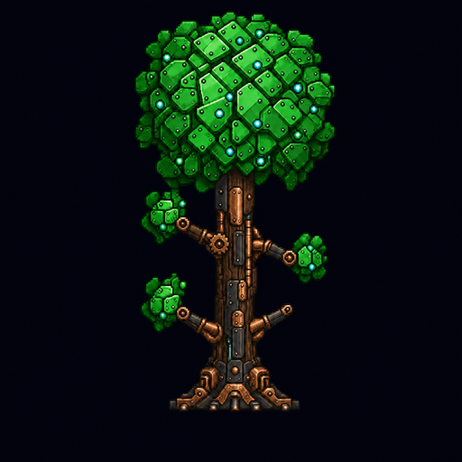

<p align="center">
  
</p>

<h1 align="center">TerraExplorer</h1>

<p align="center">
  <strong>A deterministic, explorable 2D world-generation laboratory.</strong><br>
  Original pixel maps, 107 named passes, and rather more lava than workplace safety recommends.
</p>

<p align="center">
  <a href="https://github.com/IsolatedSingularity/Terraria-Generation/actions/workflows/ci.yml"></a>
  
  
</p>


TerraExplorer turns one text seed into a complete tile world that can be watched,
scrubbed through, inspected, rendered, and exported. Terrain, walls, liquids,
biomes, structures, and generation notes remain separate, which makes the
result useful as both a map and a procedural-generation workbench.

The animation above follows the actual pipeline. Its final world pauses for two
seconds so there is time to spot the Dungeon keep, buried Pyramid, Jungle
Temple, Shimmer-filled Aether, floating-island waterfall, spreading biomes, and
Underworld cities.

> The Guide was unavailable. The machine grew a forest and marked spawn anyway.

This is an independent educational project built with original Python code and
original art. It does not read or write Terraria `.wld` files, copy private
game code, or ship Re-Logic sprites.

## Open the workshop

Python 3.11 or newer is required. Tkinter is included with standard Windows
Python; some Linux distributions provide it separately as `python3-tk`.

```bash
git clone https://github.com/IsolatedSingularity/Terraria-Generation.git
cd Terraria-Generation
python -m pip install -e .
python -m terraexplorer gui
```


The desktop app keeps the whole forge in frame. Its center map is deliberately
wide, the generation log is narrow, and the window title and export controls
remain visible. The evolution rail contains 26 meaningful milestones with
previous, next, play, and pause controls. Playback reverses at each end, so the
world can grow and un-grow without restarting generation.

You can also pan and zoom, inspect individual tiles, switch biome and depth
overlays, compare against the previous world, and export PNG, GIF, NPZ, or JSON.
Generation runs off the Tk event loop and can be cancelled between passes.

For a headless run:

```bash
terraexplorer generate --seed "mechanical-tree" --evil crimson --hardmode \
  --png world.png --npz world.npz --json world.json --gif generation.gif
```

Preview worlds are quick `240 x 140` experiments. Small worlds use the much
deeper `4200 x 1200` grid. Windows packaging produces
`dist/TerraExplorer.exe`.

## One seed, three futures


All three panels begin with the exact same seed. Only the selected world rules
change: Corruption cuts branching violet chasms, Crimson builds linked red
chambers, and Hardmode drives opposing Hallow and evil bands through the
Caverns. This is a controlled comparison, not three fortunate screenshots.

The Dryad would have opinions. TerraExplorer keeps the arrays and tile counts.

## Six places worth packing for


The landmark atlas shows six distinct generated systems:

| Above and below | What is modeled |
|---|---|
| Floating island | Sky-brick shelter, lake, and a water outlet that falls from the island |
| Dungeon | A crenellated surface keep connected to descending rooms and corridors |
| Buried Pyramid | Sandstone shell, entrance shaft, treasure chamber, and buried profile |
| Aether | Stone and gem shell around a pool whose liquid kind is Shimmer |
| Jungle Temple | Sealed brick footprint, multiple corridors, traps, and altar chamber |
| Underworld city | Obsidian-brick ruins, rooms, bridges, lava gaps, and Hellforge placement |

The overview below puts those landmarks back into a full Small world. The
biome tint and layer guides are diagnostic overlays; the symbols are original
map marks rather than borrowed sprites.


## Biomes should not all tell the same story


These are six independent, biome-centered crops rather than the same three
landmarks repeated under different colors. Forest exposes open surface caves;
Snow forms ice shelves; Desert layers sand, hardened sand, and sandstone;
Jungle packs mud and vines around denser cavities; Corruption branches through
ebonstone; Crimson joins rounded chambers through a descending spine.

## The world does not stay still


The spreading study starts with a generated pre-Hardmode world, advances
deterministic natural spread, applies the Hardmode V, and continues both evil
and Hallow growth. Spread changes tile and biome state, respects natural host
materials, and does not wrap across world boundaries.

## The long way down


This descent travels through one `4200 x 1200` world. It has no decorative
title competing with the terrain: a compact live depth label stays over the
map, while the separate gauge marks Space, Surface, Underground, Rock, Deep
Caverns, Underworld, and Bottom with intermediate ticks.

It is a longer trip than the preview used to imply. Bring rope.

## What the world remembers

```python
from terraexplorer import Evil, WorldConfig, generate_world

world = generate_world(
    WorldConfig(seed="TerraExplorer", evil=Evil.CRIMSON, hardmode=True)
)

print(world.tiles.shape)                 # (140, 240) in Preview mode
print(world.metadata["selected_ores"])

tiles = world.tiles                      # uint8
walls = world.walls                      # uint8
liquid_amount = world.liquid_amount      # uint8
liquid_kind = world.liquid_kind          # uint8
biomes = world.biomes                    # uint8
surface_height = world.surface           # int16
```

Every random decision derives from the project seed and a stable pass label.
Changing `Dungeon` therefore cannot silently reshuffle `Living Trees` or every
later pass. Separate arrays also let a wall or liquid coexist with an air tile.

```text
WorldConfig
    -> TerraExplorerPipeline
        -> isolated RNG stream for each named pass
            -> tiles + walls + liquids + biomes + metadata + landmarks
                -> desktop app | CLI | PNG/GIF | NPZ/JSON
```

The supported package is `terraexplorer`. The former `terraforge` imports and
console commands remain as compatibility aliases, but new code should use the
new name.

## Accuracy without pretending

TerraExplorer follows the public 107-step Terraria 1.4.4.9 generation order as
a reference, with its own IDs, algorithms, random streams, and art. The current
inventory contains 67 modeled passes, 39 approximated passes, and one documented
pass. Modeled means a distinct operation changes the world or metadata. It does
not mean byte-for-byte compatibility.

Recent improvements include biome spread, floating-island waterfalls and
houses, a stronger Dungeon exterior, buried Pyramids, a multi-room Temple,
Shimmer in the Aether, and Underworld ruins with Hellforges. Remaining
approximations are listed plainly in the
[fidelity inventory](docs/FIDELITY.md). Data boundaries and extension rules
live in the [architecture guide](docs/ARCHITECTURE.md).

`Engine/`, `Code/`, and `Advanced/` are a labeled research archive. They are
not part of the runtime package.

## Development

```bash
python -m pip install -e ".[dev,build]"
ruff check terraexplorer terraforge tests scripts packaging
ruff format --check terraexplorer terraforge tests scripts packaging
mypy terraexplorer
pytest --cov=terraexplorer
python -m build
```

Rebuild the tracked original media with:

```bash
python -m scripts.generate_media
python -m scripts.capture_gui  # requires a visible Windows desktop
```

CI tests Python 3.11, 3.12, and 3.13 on Windows and Ubuntu. Windows release
packaging builds `TerraExplorer.exe`. See [CONTRIBUTING.md](CONTRIBUTING.md)
and [CHANGELOG.md](CHANGELOG.md) before sending a patch.

<details>
<summary><strong>Earlier teaching plots</strong></summary>

The repository began as a set of procedural-generation experiments. These
three diagrams remain useful background, while new work belongs in
`terraexplorer/`.

| Surface noise | Cave smoothing | Ore distribution |
|---|---|---|
|  |  |  |

</details>

## Legal

TerraExplorer is not affiliated with, endorsed by, or sponsored by Re-Logic.
Terraria and its related names and assets belong to their respective owners.
No license is granted for this repository. All rights are reserved by the
project copyright holder.
