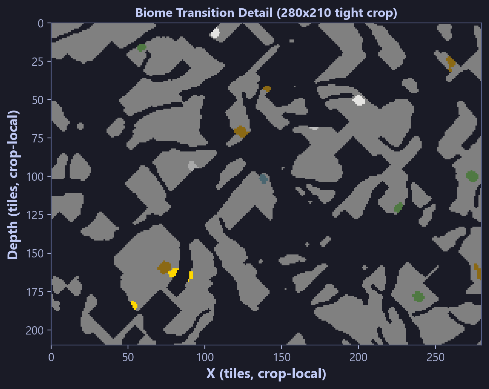
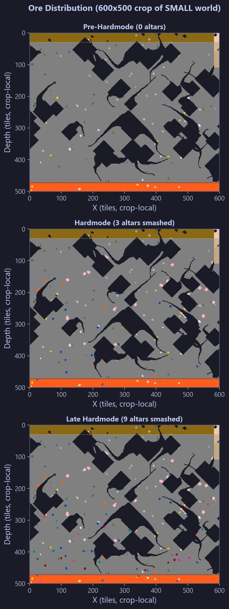
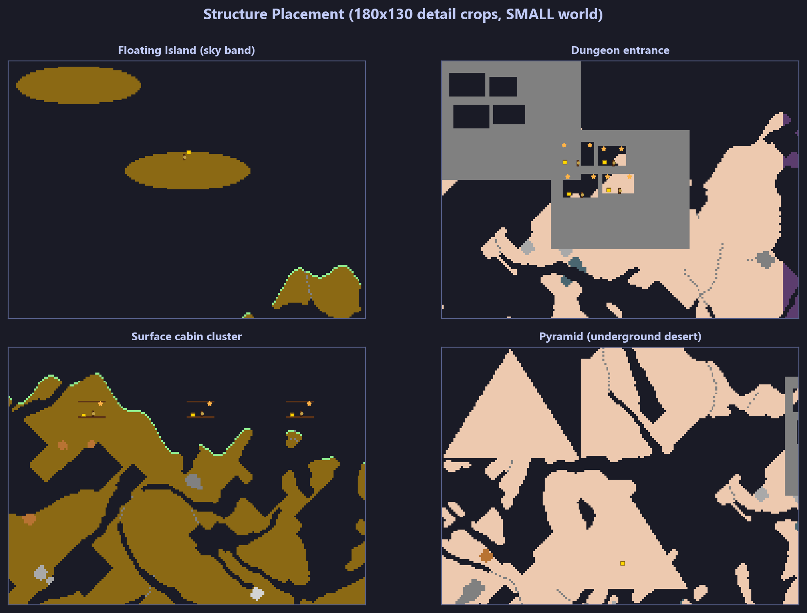
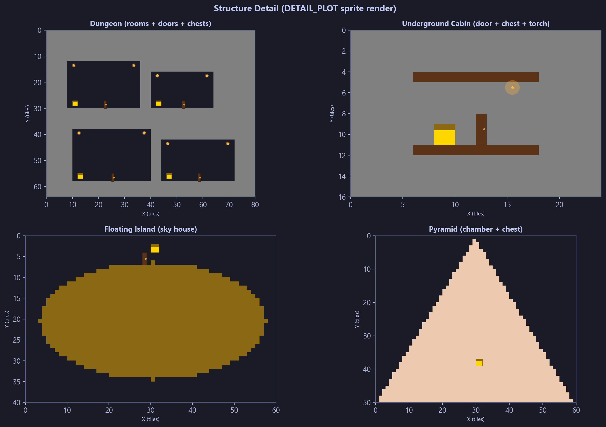

# Terraria World Generation


[](https://www.python.org/)
[](https://numpy.org/)
[](https://scipy.org/)
[](https://matplotlib.org/)
[](https://seaborn.pydata.org/)

## Overview

A faithful Python reimplementation of Terraria's **103-pass world generation pipeline**, derived from decompiled `WorldGen.cs` source analysis. The project provides an `Engine/` core library of game-accurate algorithms and constants, plus visualization scripts that produce dark-themed publication-quality plots and animations.

Key algorithms reproduced:

- **TileRunner** diamond-brush random walk (cave carving, ore veins, biome conversion)
- **Cellular automata smoothing** for organic cave edges
- **Gravity-based liquid settling** with water/lava/honey interaction rules
- **Tile update cycle infection spread** with surface vs underground rates and air gap blocking
- **StructureMap exclusion zones** for conflict-free placement
- **Dungeon eating algorithm** with interlocking rooms

## Visualizations

### Surface Terrain


Multi-octave sine noise terrain generation showing individual frequency components, composite waveform, and tile-grid rendering. Each biome type uses distinct noise parameters.

### Cave Systems


TileRunner-based cave carving with depth-dependent density. Surface caves use smaller strength (4-8) and fewer steps; rock-layer caves use strength 10-22 with up to 100 steps. Cellular automata smoothing rounds cave edges.

### Biome Distribution


Large world biome placement following game rules:

- Jungle always opposite the Dungeon side
- Snow biome on the same side as the Dungeon
- Evil biome placed independently (either hemisphere)
- 1 surface Desert + 1 Underground Desert (circular ant-hive)
- 6 Floating Islands, 16-32 Marble caves, similar Granite caves
- Underground Mushroom biome in the cavern layer
- 45-tile border buffer on all edges



DETAIL_PLOT (600x400) sprite render of a 3-biome surface transition (Forest -> Jungle -> Desert) showing how Terraria's biome converters swap base materials (Dirt -> Mud / Sand, Stone -> Ebonstone) across hard boundaries while preserving topography.

### Biome Tile Conversion


Side-by-side tile-grid visualization of biome conversion rules: Snow (dirt to snow/ice), Jungle (dirt to mud), Corruption (stone to ebonstone, dirt to corrupt dirt).

### Ore Distribution



Three-panel detail at FEATURE_PLOT scale (500x300): pre-Hardmode veins, post-altar Hardmode tier, and a 200x120 vein-detail crop with white luster scatter. Ore counts use the game's `int(area * 6E-05)` vein formula. Pre-Hardmode picks alternating pairs (Copper/Tin, Iron/Lead, Silver/Tungsten, Gold/Platinum); Hardmode altar smashing follows the 3-cycle Cobalt/Palladium, Mythril/Orichalcum, Adamantite/Titanium tiers.


Depth-density profiles showing tile counts per row, with Tokyo Night layer boundary markers.

### Structure Placement



Macro-scale (LARGE 8400x2400) scatter of game-accurate structure quotas with StructureMap exclusion zones: 6 Floating Islands, 140-160 Underground Cabins, up to 403 Life Crystals, 42 Surface Chests, 1 Dungeon, 1 Jungle Temple.



Four-panel sprite render of representative structures rendered at tile scale via the `Engine.spriteRenderer` module: Dungeon (4 interlocking rooms with doors and torches), Underground Cabin (door + chest + platforms + torch), Floating Island (lens-shaped grass island with embedded chest), and Pyramid (sandstone-brick triangle silhouette).

### Liquid Physics


Gravity-based liquid settling simulation showing water, lava, and honey behavior with obsidian and crispy honey block formation at contact boundaries.

## Advanced Simulations

### 23-Pass World Generation Pipeline


Every pass of the 23-step pipeline rendered at 1/10 scale (840x240): Reset, Terrain, Stone Layer, Sand Patches, Rocks In Dirt, Dirt In Rocks, Clay, Silt, Surface Caves, Dirt Layer Caves, Rock Layer Caves, Smooth World, Snow Biome, Jungle, Corruption, Floating Islands, Underworld, Shinies, Dungeon, Settle Liquids, Life Crystals, Grass, Border Buffer.


### Corruption/Crimson/Hallow Evolution


Full infection lifecycle: pre-hardmode evil pockets via TileRunner, hardmode V-pattern diagonal carving, tile-update-cycle spread with asymmetric surface/underground rates (`SURFACE_UPDATE_RATE=140s`, `UNDERGROUND_UPDATE_RATE=830s`), and air gap blocking demonstration (`INFECTION_GAP_TILES=4`).


### Complete World Evolution


Seven-phase lifecycle from empty grid to late Hardmode: base terrain, cave systems, biome painting, pre-HM ores + Life Crystals, V-pattern, altar-smashing HM ores, infection spread with radius-3 neighbor sampling and air gap blocking.

### Hardmode Transformation


Detailed hardmode mechanics: 3-cycle ore generation (Cobalt/Palladium tier 1, Mythril/Orichalcum tier 2, Adamantite/Titanium tier 3), Chlorophyte growth in jungle cavern, and biome conversion visualization.


### Master Evolution


Complete 26-frame animation covering all 10 phases: world generation (23 passes), corruption initial state, hardmode V-pattern, altar smashing, infection spread, and Chlorophyte growth.

## Architecture

```
Engine/                              # Core library
    __init__.py
    algorithms.py                    # tileRunner, digTunnel, cavinator (all accept seed=), cellularAutomataSmooth, settleLiquids
    constants.py                     # WorldSize (SMALL/MEDIUM/LARGE/FEATURE_PLOT/DETAIL_PLOT), LayerDepths, StructureQuotas, OreConfig, tile/wall IDs
    structures.py                    # 12 structure generators + 8 placement passes, vectorized spreadGrass
    structureMap.py                  # Rectangle + StructureMap exclusion zones
    spriteRenderer.py                # Crisp pixel-tile rendering + structure composers (drawDungeon/drawCabin/drawFloatingIsland/drawPyramid/...)
    theme.py                         # Tokyo Night Storm PALETTE, COLORS, BIOME_COLORS, TILE_COLORS, ORE_COLORS, buildTileColormap, applyTokyoNight
Code/                                # Visualization scripts (FEATURE_PLOT and DETAIL_PLOT scale)
    terrariaBiomeAnalysis.py         # LARGE biome layout + DETAIL_PLOT sprite-rendered biome transition
    terrariaNoiseSystems.py          # Surface terrain (4 biomes) + cave systems + tile conversion
    terrariaOreDistribution.py       # 3-panel ore distribution with vein-detail luster crop + depth density
    terrariaStructureGeneration.py   # Macro density scatter + 4-panel sprite detail
    Excess/
        terrariaLiquidPhysics.py     # Liquid settling simulation
Advanced/                            # Full-scale simulations
    __init__.py
    terrariaWorldGeneration.py       # 23-pass pipeline thumbnail grid + animation
    terrariaCompleteWorldEvolution.py # 7-phase lifecycle (840x240)
    terrariaCorruptionEvolution.py   # Infection spread + air gap demo
    terrariaHardmodeStructures.py    # HM ore + Chlorophyte
    terrariaHardmodeDetailedAnimation.py # HM animation
    terrariaMasterEvolution.py       # 26-frame master GIF
Plots/                               # Generated output (tracked so README renders on GitHub)
    Advanced/
    Excess/
References/                          # Research documentation (gitignored)
```

## Setup

```bash
git clone https://github.com/IsolatedSingularity/Terraria-Generation
cd Terraria-Generation
pip install -e .          # editable install (Engine becomes importable)
```

> `pip install -e .` uses the `[build-system]` in `pyproject.toml` to expose the `Engine/` package.

### Generate All Plots

```bash
# Code/ visualizations
python Code/terrariaBiomeAnalysis.py
python Code/terrariaNoiseSystems.py
python Code/terrariaOreDistribution.py
python Code/terrariaStructureGeneration.py
python Code/Excess/terrariaLiquidPhysics.py

# Advanced simulations
python Advanced/terrariaWorldGeneration.py
python Advanced/terrariaCompleteWorldEvolution.py
python Advanced/terrariaCorruptionEvolution.py
python Advanced/terrariaHardmodeStructures.py
python Advanced/terrariaHardmodeDetailedAnimation.py
python Advanced/terrariaMasterEvolution.py
```

## Key Formulas

**Ore vein count**: `int(worldArea * 6E-05)` per ore type

**TileRunner diamond brush**: Carves/places tiles in a diamond shape of radius `strength` at each step, random-walking `steps` times. All algorithms use `np.random.default_rng(seed)` for full reproducibility.

**Infection spread**: Each tile update cycle, infected tiles pick one random neighbor within radius `INFECTION_SPREAD_RADIUS` (3 tiles). Conversion is blocked by `INFECTION_GAP_TILES` (4) consecutive air tiles on the path.

**Layer depths** (large world, 8400x2400): `worldSurface=340`, `rockLayer=880`, `hellLayer=2200`.

## References

- Decompiled `WorldGen.cs` from Terraria source (Re-Logic)
- Perlin, K. (1985). "An Image Synthesizer". Computer Graphics, 19(3), 287-296
- See [References/worldgen-research.md](References/worldgen-research.md) for full research notes

## License

MIT License. All Terraria-related content and mechanics are owned by Re-Logic.
