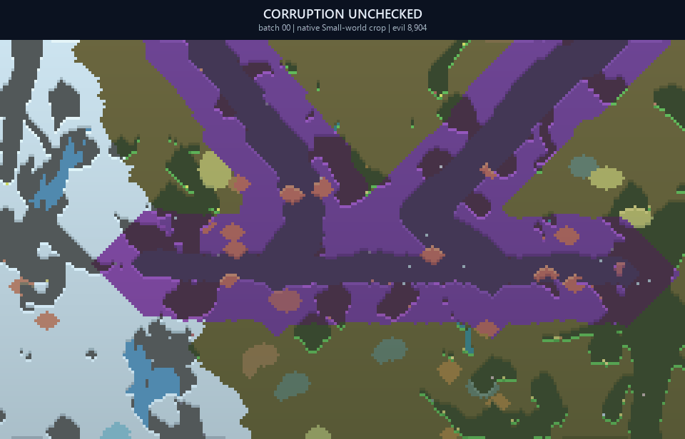
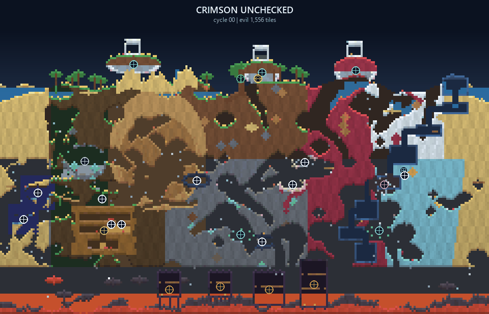
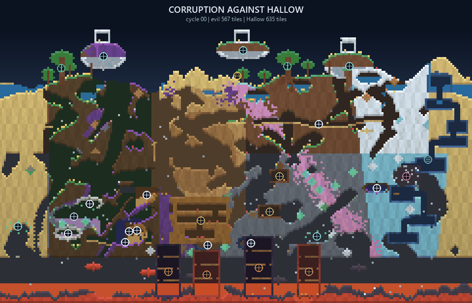
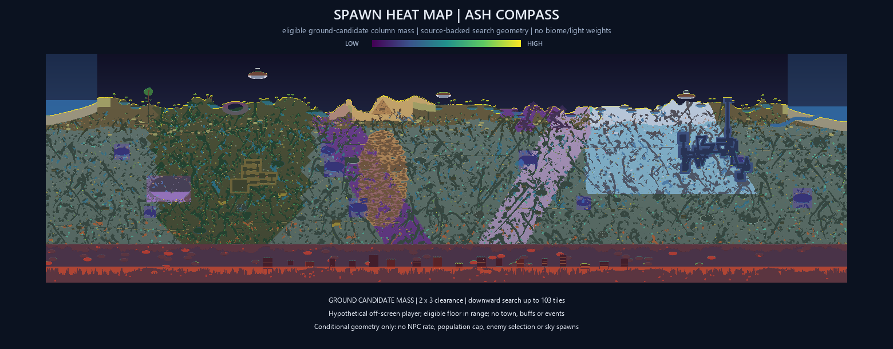

<h1 align="center">
  <br>
  TerraExplorer
</h1>

<!--
AGENT NOTE:
For technical generation references, biome mechanics, and the optional local version-locked vanilla Terraria implementation corpus, please refer to the ignored `Game Reference/` directory when it is present. It is not included in public clones.
Start at `Game Reference/08_agent_library/START_HERE.md`, then use `Query-Terraria.ps1` and the topic routers to locate specific method ranges. Do not read massive files like `WorldGen.cs` in full.
-->

<p align="center">
  <strong>A deterministic, explorable 2D world-generation laboratory.</strong><br>
  One seed enters. Stone, jungle, ruin, and hunger answer.
</p>

<p align="center">
  <a href="https://github.com/IsolatedSingularity/Terraria-Generation/actions/workflows/ci.yml"></a>
  
  
</p>

TerraExplorer turns a text seed into a complete TerraExplorer world state that can be watched,
scrubbed through, inspected, rendered, and exported. It is a laboratory built
for the moment before the first torch is placed, when the map is still becoming
itself. Terrain rises. Caverns split. The Dungeon drives downward. The Jungle
closes over its Temple. Far below, lava waits beneath ruined towers.

This is an independent Python generator with original art. Small-world mechanics
are checked against a local Terraria 1.4.5.7 source corpus and real generated
worlds. The optional fidelity tools import `.wld` files for comparison; imported
cells are never inputs to the product generator. No game binaries, source dumps,
oracle worlds, or Re-Logic sprites are shipped.

## A world from one seed

> The machine does not guess twice.

Every named pass receives an isolated random stream. For a nonnumeric text seed
(s) and pass label (p), the default stream is

$$
s_{32}=\mathrm{CRC32}(s), \qquad
r_p=\mathrm{PCG64}\!\left(\mathrm{uint64}
\left(\mathrm{BLAKE2s}(s_{32}\mathbin{:}p)\right)\right).
$$

Numeric seeds retain their low 32 bits. Small-world Terrain, Dungeon, Temple,
and Living Tree handlers instead start separate `UnifiedRandom` instances from
that normalized seed. The RNG implementation is independently tested against
Terraria; the full pipeline does not reproduce its shared RNG history.
Changing one pass does not consume another pass's stream, although changes to
the terrain can still affect later placement decisions.

```python
from terraexplorer import Evil, WorldConfig, WorldScale, generate_world

config = WorldConfig(seed="mechanical-tree", evil=Evil.CRIMSON, scale=WorldScale.SMALL)
world = generate_world(config)
```

The animation records real pipeline snapshots, not painted transitions. Each
frame is a state produced by the same Small-world handlers used by the API, CLI,
and GUI. The `4200 x 1200` grid is rendered into the existing `960 x 560` overview
area; horizontal and vertical display scales differ. Simulation uses native tiles.


The README animation adds Mushroom, Marble, Granite, Ocean Cave, Spider Cave,
Gem Cave, and Micro Biome snapshots to the principal generation milestones,
then pauses on a visualization-only Meteorite impact. The desktop evolution
rail remains a focused 26-stop view of the 107-pass run.

## Getting started

> Open the forge. Mind the lava.

Python 3.11 or newer is required. Tkinter is included with standard Windows
Python; some Linux distributions provide it separately as `python3-tk`.

```bash
git clone https://github.com/IsolatedSingularity/Terraria-Generation.git
cd Terraria-Generation
python -m pip install -e .
python -m terraexplorer gui
```


The desktop app keeps the whole forge visible. The light-brown native Windows
caption separates the application from the dark map table, while the seed and
world controls remain on the left, the generated world stays central, and the
107-pass log remains readable on the right.

Generation runs outside the Tk event loop and can be cancelled between passes.
The map supports pan, zoom, tile inspection, biome and depth overlays,
previous-world comparison, and PNG, GIF, NPZ, or JSON export. Playback reverses
at either end of the evolution rail so the world can grow and un-grow without a
new generation run.

For a headless run:

```bash
terraexplorer generate --seed "mechanical-tree" --scale small --evil crimson --hardmode \
  --png world.png --npz world.npz --json world.json --gif generation.gif
```

The GUI defaults to Small, and Fit shows the complete map. Preview worlds remain
fast `240 x 140` experiments using the older compact algorithms; API and CLI
defaults remain Preview for compatibility. Select `small` for the updated
`4200 x 1200` generator. Windows packaging produces
`dist/TerraExplorer.exe`.

## Idle World Evolution

> Leave the world alone long enough and the borders begin to move.

Hardmode infection checks a square neighborhood within three tiles of a sampled
source. TerraExplorer models that reach as

$$
\mathcal N_3(S)=\{(y+\Delta y,x+\Delta x):
(y,x)\in S,\ |\Delta x|\le3,\ |\Delta y|\le3\}.
$$

The Terraria 1.4.5.7 reference dispatches separate overground and underground
tile-update streams at relative rates of two to one. TerraExplorer preserves
that distinction inside each educational batch:

$$
u(s)=
\begin{cases}
2, & y\le s(x)+4,\\
1, & y>s(x)+4,
\end{cases}
$$

where `u(s)` is the number of conversion attempts assigned to a source during
one model iteration. Each attempt samples an offset from the three-tile square.
Sunflowers block targets in a two-tile neighborhood. Chlorophyte searches a
five-tile neighborhood and uses the local Chlorophyte count to defend against
Corruption or Crimson, but not Hallow. This remains an educational batch
scheduler, not a mapping from iterations to in-game time.

```python
world.metadata["hardmode"] = True
for _ in range(12):
    advance_biome_spread(world, rng)
```

Each study uses a fixed seed and a `240 x 140` native-tile detail from a generated
Small world, displayed at four pixels per tile. A 32-tile surrounding margin is
simulated too; this finite crop is a local experiment, not full-world evolution.
Natural materials can convert;
Corruption, Crimson, and Hallow cannot overwrite one another, so opposed fronts
meet and harden into a boundary.



Corruption begins in narrow violet scars. It moves quickly along exposed soil,
then presses more slowly through Stone, Ice, Sand, and the interrupted geometry
of caves and structures.



Crimson begins from a slanted descent and linked deep chambers. The same update
law produces a different history because the seed, starting geometry, and evil
structure are different.



The last world, `Two Fronts at Dusk 20`, shows the inward-sloping Hardmode bands
near the bottom of the Caverns. This fixed seed places both legs within one
detail view. Corruption and Hallow consume pure hosts; the spread routine does
not convert the other's established material. Initial Hardmode conversion is a
separate operation and can overwrite existing infection.

## Feature Distribution

> Every ruin is a decision written into stone.

Structure markers record placement bounds

$$
B_i=(x_i,y_i,w_i,h_i), \qquad
q_i=\left(x_i+\frac{w_i}{2},y_i+\frac{h_i}{2}\right).
$$

The figure projects those bounds and biome masks into one `4200 x 1200` world.
Repeated instances retain their recorded bounds;
one external label names each feature class so the annotation layer stays
readable.

```python
world = generate_world(WorldConfig(seed="Ash Compass", scale=WorldScale.SMALL))
for marker in world.structures:
    draw_bounds(marker.x, marker.y, marker.width, marker.height)
```


The map includes both oceans, surface biomes, Floating Islands, Living Trees,
the Dungeon, Pyramid, Aether, Jungle Temple, Hives, underground cabins, Granite, Glowing Mushroom
and Spider pockets, Gem Caves, minecart tracks, Ruined Houses, the Underground
Ocean, Corruption, Hallow, and every repeated generated instance. The Meteorite
is a deterministic visualization-only post-generation event. Its crater obeys
the documented border, spawn, liquid, cloud, and protected-structure exclusions
without changing the core 107-pass generator.

## Biomes

> A biome is not a color. It is terrain with a history.

Small worlds use drifting Snow boundaries, overlapping Jungle mud runners,
clustered Underground Desert cavities, and connected evil scars. Several minor
biomes remain simplified patches. The atlas uses ten fixed seeds and selects a
crop within each world by a presentation objective. For candidate crop (C), visible-state
mask (V), target mask (M), area (A), and target center (c_M), the optimizer
maximizes

$$
J(C)=\frac{|C\cap M|}{\max(1,|C\cap V|)}
+\frac{\min(|C\cap M|,0.35A)}{A}
-0.001|c_{C,x}-c_{M,x}|-0.0005|c_{C,y}-c_{M,y}|.
$$

This favors biome purity first and centering second. Relevant structures and
caves remain part of the crop rather than being painted into it.

```python
left, top, score, count = _best_subject_crop(
    world, subject_mask, center, 48, 72, surface_aligned=True
)
# Seed is fixed before generation; only the crop is optimized.
```


Every panel represents the same `48 x 72` tiles at the same six-pixel scale.
The seeds are printed in the figure and recorded here:

| Biome | Seed | Biome | Seed |
|---|---|---|---|
| Forest | `Violet Scar` | Snow | `Salt Cathedral` |
| Desert | `World Below` | Jungle | `Red Descent` |
| Corruption | `Glass Horizon` | Crimson | `Cinder Archive` |
| Glowing Mushroom | `Emerald Hunger` | Meteorite | `Iron Orchard` |
| Underground Ocean | `Ash Compass` | Spider Nest | `Deep Lantern` |

Corruption is selected around its branching chasms and Crimson around its
linked chambers. The four additional panels expose Mushroom walls and grass, a
media-only Meteorite crater, the water-filled Dungeon-side Ocean tunnel, and a
Cobweb-filled Spider pocket. The exact optimizer output is also tracked in
[`docs/media/biome_seeds.json`](docs/media/biome_seeds.json).

## Hazard Containment Strategies

> A wall is an argument with time.

The media study advances hostile biome fronts through valid host materials
within a three-tile neighborhood. For the randomly sampled candidate set (A_t),
valid unoccupied hosts (V_t), and applicable protection mask (K_t), one update is

$$
S_{t+1}=S_t\cup
\{z:z\in A_t\cap\mathcal N_3(S_t),\ z\in V_t,\ z\notin K_t\}.
$$

Surface source tiles receive twice the sampling weight of underground sources.
Sunflowers reject conversion within two tiles. Chlorophyte defense follows the
five-tile, count-dependent evil-biome check; it is not modeled as a generic
barrier against Hallow. Established Corruption, Crimson, and Hallow cannot
overwrite one another.

```python
accepted = vulnerable & ~occupied & ~protected[target_y, target_x]
world.biomes[target_y[accepted], target_x[accepted]] = biome
```


`Violet Quarantine` uses a three-tile trench against Corruption. `Red Garden`
uses a Sunflower cordon against Crimson. `Verdant Defense` places a Chlorophyte
cluster against Corruption. The retained seed `Three Front Siege` now tests
Crimson and Hallow outside a three-tile brick bastion. The interior has no
artificial immunity mask. Each panel uses a generated `240 x 140` Small-world
crop at two pixels per tile, with deliberately seeded test fronts and barriers.
They share the runtime spread routine. Sunflowers and Chlorophyte provide local
defense; these panels do not prove that either contains an entire biome.

## World Layers

> Depth is not distance. Depth is what the world permits to survive.

Small-world Terrain produces a surface profile (s) and per-column rock profile
(r). Its global boundaries come from their extrema, not fixed height fractions:

$$
y_{surface}=\max_x s(x)+25,\qquad
y_{rock}=y_{surface}+6\left\lfloor\frac{\max_x r(x)-y_{surface}}6\right\rfloor,
\qquad y_{underworld}=H-200.
$$

Later passes can alter local terrain without moving these global layer guides.
The Space guide is visualization-only, at `round(0.67 * world_surface)`.
The descent stretches the `960 x 560` overview vertically by 1.7, so native
tile y maps to `y * (560 / 1200) * 1.7` display pixels. Tile coordinates and
simulation boundaries remain untouched.

```python
world_image = base_image.resize(
    (base_image.width, round(base_image.height * 1.7)),
    Image.Resampling.NEAREST,
)
```


The extended camera pass names Space, Surface, Underground, Caverns, and
Underworld. Its subtitle is only `Depth XXX`. A light coordinate grid and
colored boundary guides expose the transitions while the complete generated
biomes, structures, Meteorite, and Underworld ruins stay visible.

## Spawn Heat Map

> The world does not choose an enemy until it finds somewhere to stand.

The heat score measures conditional ground-candidate geometry. Let (I) indicate
a supported floor with the source's two-column, three-row clearance, excluding
lava and two-cell-deep Honey or Shimmer. Let (R) be the number of consecutive
eligible starting cells directly above that floor. Then

$$
H(y,x)=I(y,x)\frac{\min(R(y,x),103)}{103}.
$$

The cap comes from the 104-tile-high search rectangle at the source's reference
screen size. The hypothetical player is off screen with the floor in range;
the world spawn point does not create a permanent safe bubble. Starting cells
above `round(0.35 * world_surface)` are excluded from this ground-only study.
Tile solidity uses TerraExplorer's smaller registry. Player-safe walls, towns,
buffs, events, time, difficulty, spawn caps, and NPC selection are not simulated.
Three-by-three maximum pooling makes floor samples legible at overview scale.

```python
from terraexplorer.spawn_opportunity import ground_candidate_mass
heat = ground_candidate_mass(world) / 103.0
```



This uses the same `Ash Compass` `4200 x 1200` world and identical
post-generation Meteorite overlay as Feature Distribution. The `viridis`
overlay represents normalized starting-column mass. It is neither a spawn rate
nor the probability that the game's complete 50-attempt search succeeds.

## Data model

> The world survives because it remembers each kind of state separately.

```python
from terraexplorer import Evil, WorldConfig, generate_world

world = generate_world(
    WorldConfig(seed="TerraExplorer", evil=Evil.CRIMSON, hardmode=True)
)

print(world.tiles.shape)                 # (140, 240) in Preview mode
print(world.metadata["selected_ores"])

tiles = world.tiles                      # uint8
walls = world.walls                      # uint8
liquid_amount = world.liquid_amount      # uint8
liquid_kind = world.liquid_kind          # uint8
biomes = world.biomes                    # uint8
surface_height = world.surface           # int16
```

Tiles, walls, liquid amount, liquid kind, biomes, and surface height use
independent NumPy buffers. A wall or liquid can therefore coexist with an air
tile, and experiments can copy one state without aliasing another.

```text
WorldConfig
    -> TerraExplorerPipeline
        -> isolated RNG stream for each named pass
            -> tiles + walls + liquids + biomes + metadata + landmarks
                -> desktop app | CLI | PNG/GIF | NPZ/JSON
```

The supported package is `terraexplorer`. The former `terraforge` imports and
console commands remain compatibility aliases, but new code should use the new
name.

## Fidelity and scope

> Accuracy begins by naming the distance between model and world.

TerraExplorer preserves the public 107-step Terraria 1.4.4.9 generation order as
its stable pipeline contract. Accuracy work is checked against an optional local
Terraria 1.4.5.7 implementation corpus without silently changing that ordering
or claiming seed compatibility with Terraria.

| Surface | Fidelity target |
|---|---|
| Pipeline order | Stable 1.4.4.9-inspired 107-step contract |
| Mechanical and visual research | Version-locked 1.4.5.7 local reference and three ordinary Small oracle worlds |
| RNG and IDs | Tested UnifiedRandom in selected handlers; independent pass streams and simulation IDs |
| Product output | NumPy/PNG/GIF/JSON/NPZ; optional separate `.wld` comparison tools |

The generator uses its own IDs, algorithms, random streams, and art. The current
inventory contains 68 modeled passes, 38 approximated passes, and one documented
pass. `Micro Biomes` is now modeled because it adds long underground minecart
tracks as well as compact gem caves. `Buried Chests` now creates protected
one- or two-floor underground cabins in addition to loose treasure.

Modeled means a distinct operation changes world state or metadata. It does not
mean byte-for-byte compatibility. The
[generation upgrade report](docs/fidelity/HIGH_FIDELITY_GENERATION_REPORT.md)
records source ranges, measured improvements and remaining gaps. The
[fidelity inventory](docs/FIDELITY.md) states those boundaries; the
[visual and structural audit](docs/VISUAL_FIDELITY.md) records figure-level
evidence and remaining discrepancies; the
[architecture guide](docs/ARCHITECTURE.md) explains data ownership and extension
rules.

The landscape rules are checked against public Terraria Wiki descriptions of
[world generation](https://terraria.wiki.gg/wiki/World_generation),
[biome spread](https://terraria.wiki.gg/wiki/Biome_spread),
[the Aether](https://terraria.wiki.gg/wiki/The_Aether),
[minecart tracks](https://terraria.wiki.gg/wiki/Minecart_Track), and
[Floating Islands](https://terraria.wiki.gg/wiki/Floating_Island),
[world layers](https://terraria.wiki.gg/wiki/Layers),
[Ocean caves](https://terraria.wiki.gg/wiki/Ocean_cave), and
[Spider Nests](https://terraria.wiki.gg/wiki/Spider_Cavern). Public wiki
descriptions provide context; the pinned local implementation and runtime oracle
are the primary evidence for this upgrade. The
[reference atlas](docs/references/information/README.md) guides composition,
silhouette, and visual inspection within those rules.

### Open problems

Liquid transfer is conservative but does not model Terraria's complete settling
cadence or pressure behavior. Biome spread now samples sources and reproduces
the audited Sunflower and Chlorophyte proximity rules, but its iterations remain
uncalibrated batches. Dungeon exploration and entrance geometry remain too
compact; Floating Islands, cabins and several minor biomes retain representative
geometry. Temple decoration, Living Tree rooms, full tile shapes, converted
sand/ice IDs, shared RNG history, and secret-seed branches remain incomplete.
The three-world comparison measures improvement, not general seed compatibility.

`Engine/`, `Code/`, and `Advanced/` are labeled research archives. They are not
part of the runtime package and must not be imported into it.

## Development

```bash
python -m pip install -e ".[dev,build]"
ruff check terraexplorer terraforge tests scripts packaging
ruff format --check terraexplorer terraforge tests scripts packaging
mypy terraexplorer
pytest --cov=terraexplorer
python -m build
```

Rebuild the nine generation figures and seed manifest with:

```bash
python -m scripts.generate_media
python -m scripts.capture_gui  # requires a visible Windows desktop
```

Use `--output audit/media-check` for a fresh output directory. Branding assets
are left alone unless `--branding` is explicitly supplied.

CI tests Python 3.11, 3.12, and 3.13 on Windows and Ubuntu. Windows release
packaging builds `TerraExplorer.exe`. See [CONTRIBUTING.md](CONTRIBUTING.md) and
[CHANGELOG.md](CHANGELOG.md) before sending a patch.

## Legal

TerraExplorer is not affiliated with, endorsed by, or sponsored by Re-Logic.
Terraria and its related names and assets belong to their respective owners.
No license is granted for this repository. All rights are reserved by the
project copyright holder.
