<p align="center">
  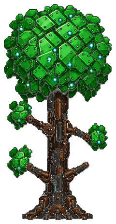
</p>

<h1 align="center">TerraExplorer</h1>

<p align="center">
  <strong>A deterministic, explorable 2D world-generation laboratory.</strong><br>
  Original pixel maps, 107 named passes, and rather more lava than workplace safety recommends.
</p>

<p align="center">
  <a href="https://github.com/IsolatedSingularity/Terraria-Generation/actions/workflows/ci.yml"></a>
  
  
</p>


TerraExplorer turns one text seed into a complete tile world that can be watched,
scrubbed through, inspected, rendered, and exported. Terrain, walls, liquids,
biomes, structures, and generation notes remain separate, which makes the
result useful as both a map and a procedural-generation workbench. Two
controlled simulations then let generated terrain face biome spread or a
meteor-driven chain reaction.

The animation above follows the actual pipeline. Its final world pauses for two
seconds so there is time to spot the Dungeon, buried Pyramid, Jungle Temple,
Shimmer-filled Aether, floating islands, spreading biomes, and Underworld
Ruined Houses.

> The Guide was unavailable. The machine grew a forest and marked spawn anyway.

This is an independent educational project built with original Python code and
original art. It does not read or write Terraria `.wld` files, copy private
game code, or ship Re-Logic sprites.

## Getting started

> Open the workshop. Mind the lava.

Python 3.11 or newer is required. Tkinter is included with standard Windows
Python; some Linux distributions provide it separately as `python3-tk`.

```bash
git clone https://github.com/IsolatedSingularity/Terraria-Generation.git
cd Terraria-Generation
python -m pip install -e .
python -m terraexplorer gui
```

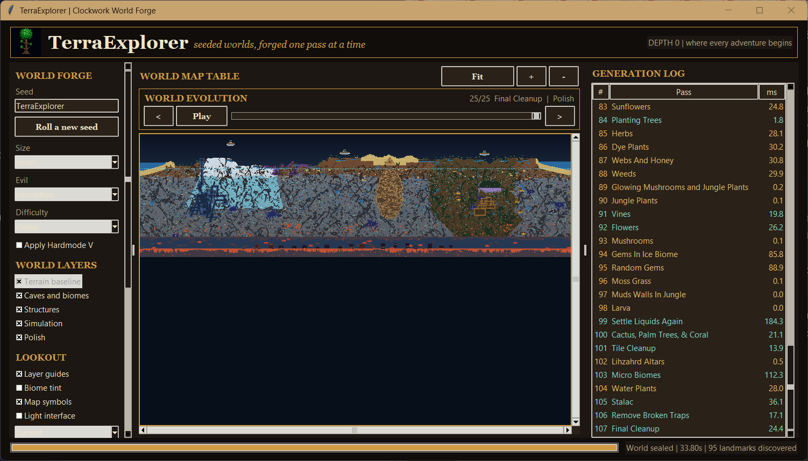

The desktop app keeps the whole forge in frame. Its center map is deliberately
wide, the generation log is narrow, and the window title and export controls
remain visible. The evolution rail contains 26 meaningful milestones with
previous, next, play, and pause controls. Playback reverses at each end, so the
world can grow and un-grow without restarting generation.

You can also pan and zoom, inspect individual tiles, switch biome and depth
overlays, compare against the previous world, and export PNG, GIF, NPZ, or JSON.
The automatic cover-fit fills the map table and centers the small amount cropped
at its edges instead of surrounding the world with empty canvas. Generation
runs off the Tk event loop and can be cancelled between passes.

For a headless run:

```bash
terraexplorer generate --seed "mechanical-tree" --evil crimson --hardmode \
  --png world.png --npz world.npz --json world.json --gif generation.gif
```

Preview worlds are quick `240 x 140` experiments. Small worlds use the much
deeper `4200 x 1200` grid. Windows packaging produces
`dist/TerraExplorer.exe`.

The full biome overview is the only README figure rendered from a Small world.
Every other map, study, and animation below is an actual Preview world—or an
exact crop from one—using the same material renderer as the hero animation.

## World-rule comparison

> One seed, three futures.

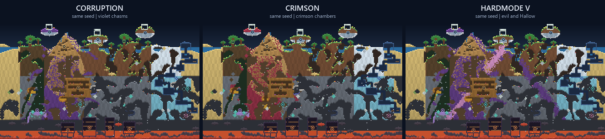

All three panels begin with the exact same seed. Only the selected world rules
change: Corruption cuts branching violet chasms, Crimson builds linked red
chambers, and Hardmode drives opposing Hallow and evil bands through the
Caverns. This is a controlled comparison, not three fortunate screenshots.

The Dryad would have opinions. TerraExplorer keeps the arrays and tile counts.

## Landmark generation

> Field notes from six places the Guide neglected to mention.

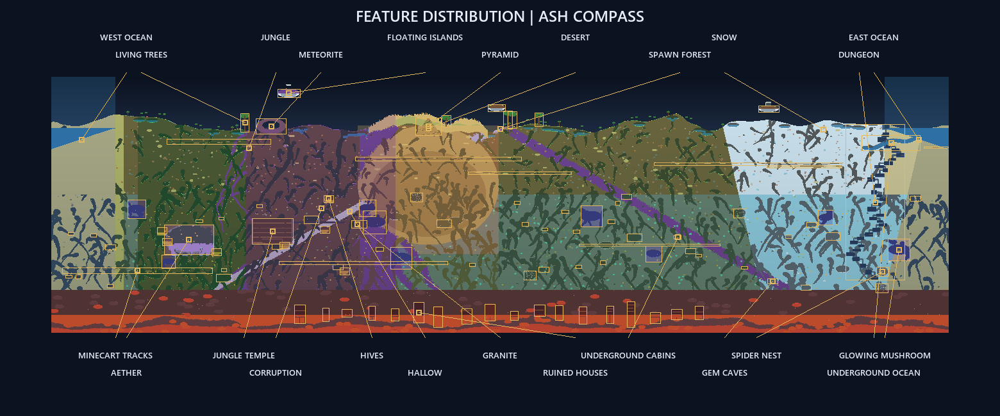

The landmark atlas shows six complete `240 x 140` Preview worlds, matching the
hero animation rather than placing tiny crops on a synthetic background. A gold
frame identifies each structure while leaving its coast, biome, depth, and
surrounding caves visible.

| Above and below | What is modeled |
|---|---|
| Floating Island | Cloud and Rain Cloud foundation, a forested cap, and a compact sky-brick house |
| Dungeon | Weathered entrance hall connected to branching rooms, corridors, and platforms |
| Pyramid | A mostly buried sandstone shell with a zigzag passage and treasure chamber |
| Aether | A stone cavern in the Jungle-side outer fifth with Shimmer and Gem Trees |
| Jungle Temple | Irregular Lihzahrd-brick rooms, passages, traps, and a deep altar chamber |
| Ruined House | An individual multi-floor obsidian or Hellstone-brick tower, sometimes flooded by lava |

The overview below is the single deliberate exception to the Preview-world
rule. It puts those improved landmarks into a full `4200 x 1200` Small world.
The biome tint and layer guides are diagnostic overlays; the symbols are
original map marks rather than borrowed sprites.

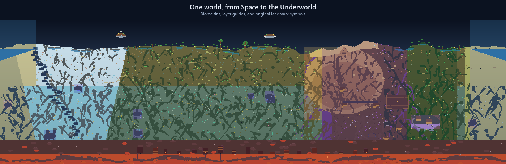

## Biome generation

> Biomes should not all tell the same story.

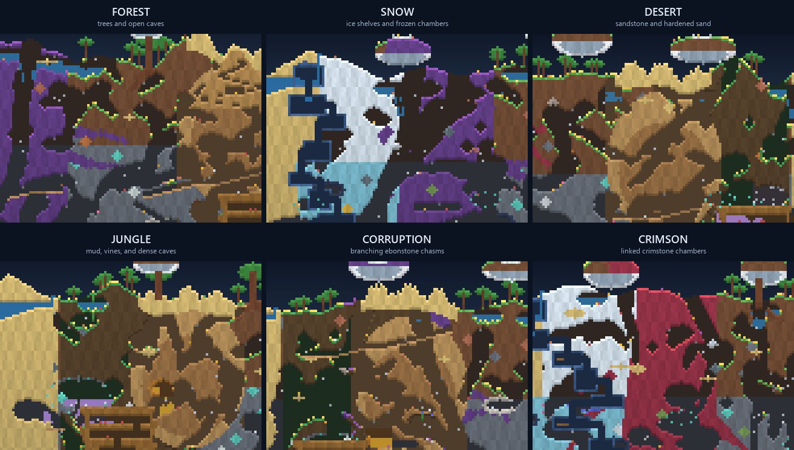

These are six independent crops from generated Preview worlds rather than the
same landmarks repeated under different colors. Forest exposes open surface
caves; Snow forms a narrowing underground wedge opposite the Jungle; Desert
places dunes over an oval, ant-hive-like Underground Desert; Jungle packs mud
and vines around larger Cavern openings. Corruption descends in straighter
chasms that connect near their bases, while Crimson enters on slants and links
rounded chambers through branching passages.

## Biome evolution

> The world does not stay still.

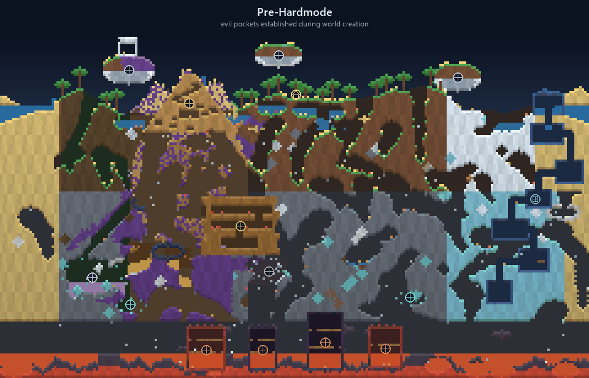

The spreading study starts with a generated pre-Hardmode world, advances
deterministic natural spread, applies the Hardmode V, and continues both evil
and Hallow growth. Spread changes tile and biome state, respects natural host
materials, and does not wrap across world boundaries.

## Biome containment simulation

> The Dryad requested controls. The laboratory supplied four.

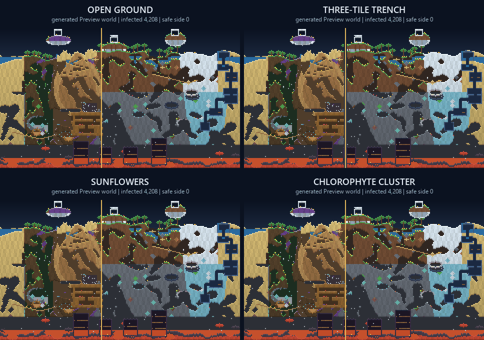

This controlled experiment starts from one generated Preview world and gives
Corruption the same terrain, caves, structures, and deterministic random stream
under four strategies: no barrier, a three-tile trench, Sunflowers, and
Chlorophyte. The gold line marks the protected-side boundary. Spread can reach
host material up to three tiles away and surface attempts are weighted six times
more heavily than underground attempts. The animation reports infected tile
counts and protected-side crossings, making the intervention rather than the
seed the independent variable.

## Catastrophe chain-reaction simulation

> A meteor, loose sediment, four liquids, and absolutely no safety review.

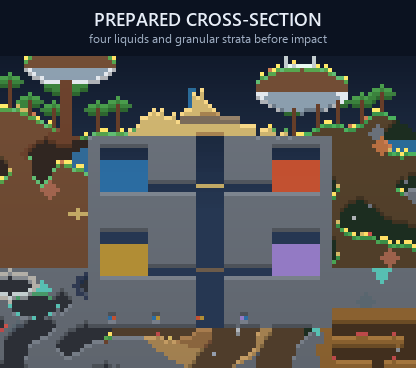

A constrained meteor site is selected away from spawn and protected landmark
columns in a generated Preview world. Four irregular pools are carved into its
existing cavern geology and connected by narrow fissures—there is no rectangular
test chamber. The impact excavates a crater and Meteorite rim, releases Sand and
Silt, and drives conservative Water, Lava, Honey, and Shimmer motion. Their
contacts form Obsidian, Honey Block, Crispy Honey Block, and Aetherium Block.
This is a deterministic educational laboratory, not a claim to reproduce
Terraria's frame-by-frame liquid engine.

## World layers

> The long way down.

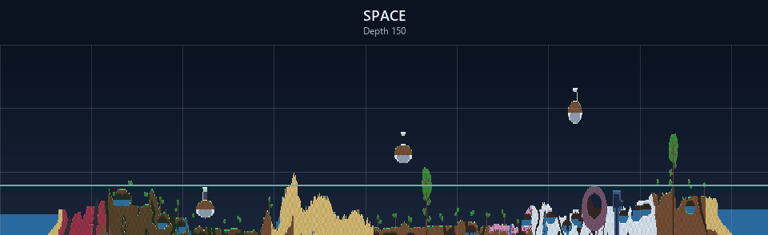

This is a vertical window through one complete `240 x 140` Preview world. The
camera keeps the full width visible while it moves from surface hills and biome
mouths through smaller Underground tunnels, larger Cavern voids, and the lava
terrain and Ruined Houses of the Underworld. The live title reports the current
layer and depth without replacing the generated terrain with a schematic gauge.

It is still a long trip. Bring rope.

## Generated-world studies

> The plot is the world.

These diagnostics no longer turn the runtime into line charts, bars, or noisy
heatmaps. Every panel is a complete generated Preview world or an exact tile
crop from one. The landscape studies show coast-to-coast biome relationships;
the cave studies compare surface, Snow, Underground Desert, and Jungle geology;
the ore studies mark actual generated veins at their real depths.

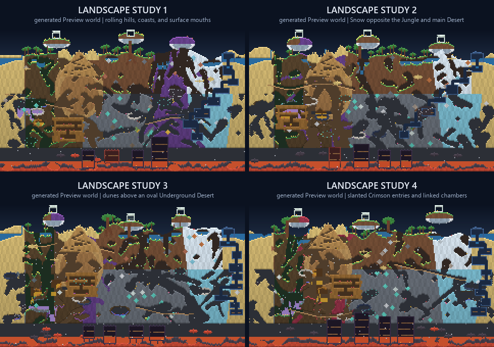

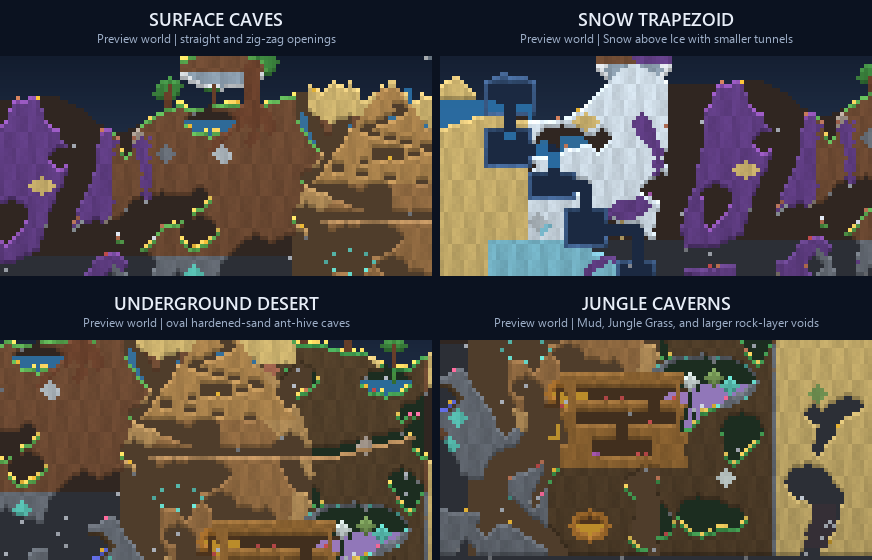

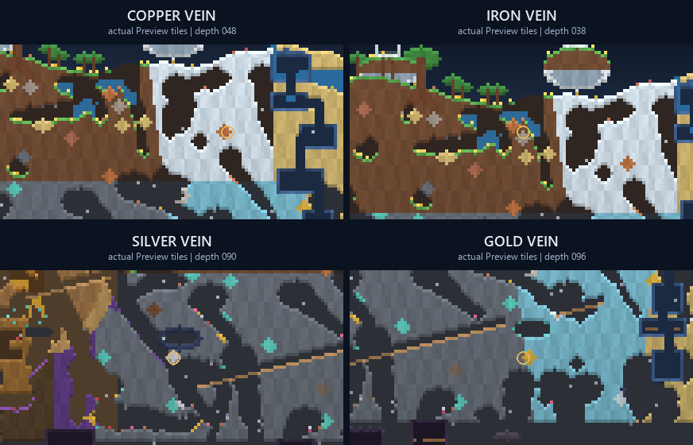

## Data model

> What the world remembers.

```python
from terraexplorer import Evil, WorldConfig, generate_world

world = generate_world(
    WorldConfig(seed="TerraExplorer", evil=Evil.CRIMSON, hardmode=True)
)

print(world.tiles.shape)                 # (140, 240) in Preview mode
print(world.metadata["selected_ores"])

tiles = world.tiles                      # uint8
walls = world.walls                      # uint8
liquid_amount = world.liquid_amount      # uint8
liquid_kind = world.liquid_kind          # uint8
biomes = world.biomes                    # uint8
surface_height = world.surface           # int16
```

Every random decision derives from the project seed and a stable pass label.
Changing `Dungeon` therefore cannot silently reshuffle `Living Trees` or every
later pass. Separate arrays also let a wall or liquid coexist with an air tile.

```text
WorldConfig
    -> TerraExplorerPipeline
        -> isolated RNG stream for each named pass
            -> tiles + walls + liquids + biomes + metadata + landmarks
                -> desktop app | CLI | PNG/GIF | NPZ/JSON
```

The supported package is `terraexplorer`. The former `terraforge` imports and
console commands remain as compatibility aliases, but new code should use the
new name.

## Fidelity and scope

> Accuracy without pretending.

TerraExplorer follows the public 107-step Terraria 1.4.4.9 generation order as
a reference, with its own IDs, algorithms, random streams, and art. The current
inventory contains 67 modeled passes, 39 approximated passes, and one documented
pass. Modeled means a distinct operation changes the world or metadata. It does
not mean byte-for-byte compatibility.

Recent improvements include the biome simulations above, Cloud-supported
floating islands, a branching Dungeon, buried zigzag Pyramids, an irregular
multi-room Temple, Gem Trees around the Jungle-side Aether, and individual
Ruined Houses in the central Underworld. Remaining approximations are listed
plainly in the [fidelity inventory](docs/FIDELITY.md). Data boundaries and
extension rules live in the [architecture guide](docs/ARCHITECTURE.md).

The landscape rules were checked against the public Terraria Wiki descriptions
of [world generation](https://terraria.wiki.gg/wiki/World_generation), the
[Underground Desert](https://terraria.wiki.gg/wiki/Underground_Desert),
[Corruption chasms](https://terraria.wiki.gg/wiki/Chasm),
[Floating Islands](https://terraria.wiki.gg/wiki/Floating_Island), the
[Tundra](https://terraria.wiki.gg/wiki/Tundra), and the
[Jungle](https://terraria.wiki.gg/wiki/Jungle). TerraExplorer models their
visible relationships with original algorithms; it does not claim exact world
parity.

### Open problems

Liquid transfer is conservative but does not yet model Terraria's complete
settling cadence or pressure behavior. Biome spread is a controlled batch model,
not an in-game tick scheduler. Secret-seed branches, more structure variants,
better biome-transition microterrain, and independent high-resolution validation
of the Small-world generator remain useful next experiments. The fidelity
inventory distinguishes those limits from completed modeled passes.

`Engine/`, `Code/`, and `Advanced/` are a labeled research archive. They are
not part of the runtime package.

## Development

```bash
python -m pip install -e ".[dev,build]"
ruff check terraexplorer terraforge tests scripts packaging
ruff format --check terraexplorer terraforge tests scripts packaging
mypy terraexplorer
pytest --cov=terraexplorer
python -m build
```

Rebuild the tracked original media with:

```bash
python -m scripts.generate_media
python -m scripts.capture_gui  # requires a visible Windows desktop
```

CI tests Python 3.11, 3.12, and 3.13 on Windows and Ubuntu. Windows release
packaging builds `TerraExplorer.exe`. See [CONTRIBUTING.md](CONTRIBUTING.md)
and [CHANGELOG.md](CHANGELOG.md) before sending a patch.

## Legal

TerraExplorer is not affiliated with, endorsed by, or sponsored by Re-Logic.
Terraria and its related names and assets belong to their respective owners.
No license is granted for this repository. All rights are reserved by the
project copyright holder.
