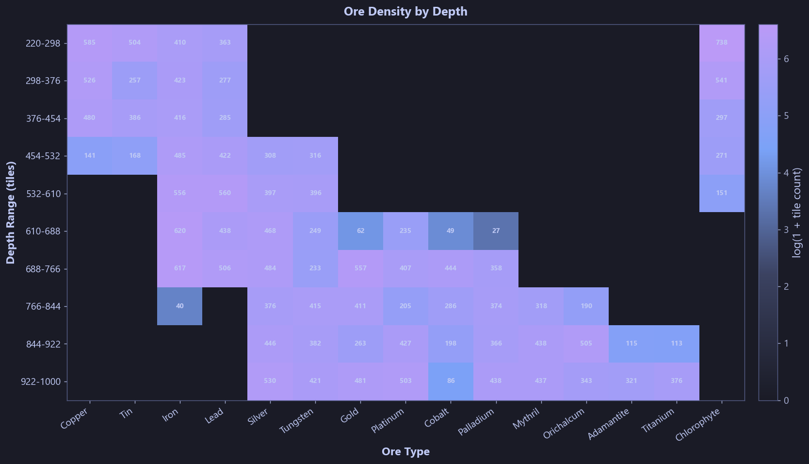
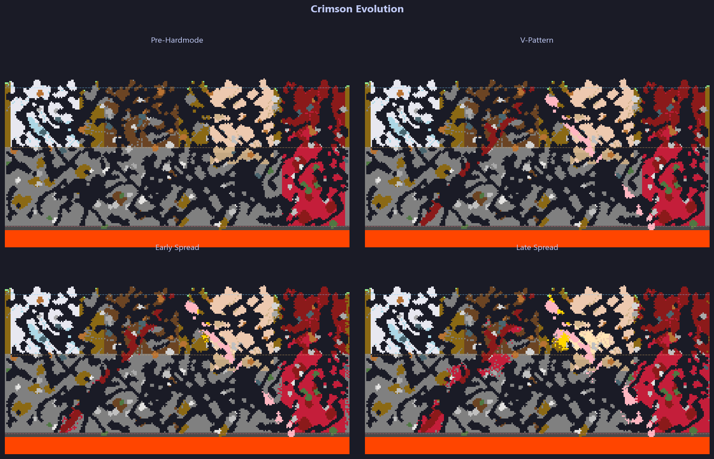

# Terraria World Generation

[](https://github.com/IsolatedSingularity/Terraria-Generation/actions/workflows/ci.yml)
[](https://www.python.org/)
[](https://numpy.org/)
[](https://scipy.org/)
[](https://matplotlib.org/)


## Overview

Every Terraria world you have ever fallen into was assembled by the same 103-pass pipeline buried inside `WorldGen.cs`. This project reverse-engineers that pipeline in Python, pass by pass, algorithm by algorithm. The `Engine/` library reproduces the game's generation logic at source-code fidelity and the visualization suite renders it in Tokyo Night dark-theme plots that feel more like a dev console than a wiki screenshot.

These are the algorithms that put the dirt under your feet:

- **TileRunner** diamond-brush random walk: drills cave networks, deposits ore veins, and paints biome conversions using the exact strength-and-step formulation from the decompiled source
- **Cellular automata smoothing**: the jagged raw voids from TileRunner get multiple rounds of majority-rule CA passes, rounding cave edges into the lacy organic shapes the game is known for
- **Gravity-based liquid settling**: water flows down, lava pools in pockets, honey sits where it sits, and the three liquids interact by the game's own collision rules
- **Tile-update infection spread**: Corruption, Crimson, and Hallow spread one random neighbor per cycle with surface vs. underground rate modifiers and hard air-gap blocking
- **StructureMap exclusion zones**: dungeon, pyramid, cabin, and floating island placement all check a shared conflict map before committing
- **Dungeon eating algorithm**: the dungeon carves interlocking rooms through solid stone with the same greedy rectangle-packing logic used in-game

## Visualizations

### Surface Terrain


The surface is a stack of sinusoidal octaves, the discrete form of fractional Brownian motion. Multi-octave noise generates individual frequency components and a composite waveform, rendered alongside the final tile grid. Each biome uses its own noise parameters, so the Snow biome's surface sits at a slightly different height than the Jungle across the map.

### Cave Systems


TileRunner carves caves from the surface down to the cavern layer. Surface caves are small and shallow (strength 4-8, up to 30 steps), rock-layer caves grow aggressive (strength 10-22, up to 100 steps). After carving, cellular automata smoothing runs several majority-rule passes to turn the diamond-shaped TileRunner marks into rounded tunnels.

### Biome Distribution


Biome placement follows a fixed ruleset that locks in the world's geography before a single cave is carved:

- Jungle always spawns on the side opposite the Dungeon
- Snow biome lands on the same side as the Dungeon
- Evil biome (Corruption or Crimson) is placed independently in either hemisphere
- One surface Desert and one Underground Desert (the ant-hive circle) per world
- Six Floating Islands, 16-32 Marble cave clusters, similar Granite pockets
- Underground Mushroom biome anchored in the cavern layer
- A 45-tile dead zone borders every edge of the map, no structures allowed


A 240x140 world rendered at full resolution. Five surface biomes sit side by side with caves carved through every stratum, so the tile conversion rules are visible right at the biome borders: dirt flips to mud as you cross into Jungle, stone turns to Ebonstone where Corruption claims it.

### Biome Tile Conversion


Side-by-side tile-grid panels showing each biome's conversion pass: Snow replaces dirt with snow and ice, Jungle swaps dirt for mud, Corruption turns stone to Ebonstone and dirt to Corrupt dirt. These are the exact tile-ID swaps from the source.

### Ore Distribution


Three separate worlds at full resolution, each with a different ore tier highlighted. Pre-Hardmode generates alternating pairs: Copper or Tin for tier 1, Iron or Lead for tier 2, Silver or Tungsten for tier 3, Gold or Platinum for tier 4. Smash three altars in Hardmode and tiers 1-3 start spawning underground in the exact zones shown here.



Depth-binned heatmap counting ore occurrences across 10 depth slices and 15 ore types from a full world. Cells use a log-scaled Tokyo Night colormap with annotated counts for anything non-zero.


## Advanced Simulations

### Generation Pipeline


The 103-pass pipeline replayed one frame at a time. A bare stone shell becomes a full world over 25 frames: surface terrain, strata boundaries, cave carving, CA smoothing, biome painting, pre-Hardmode ore scattering, V-pattern carving, and three altar tier deposits. The frame title names the active pass.

### Corruption/Crimson/Hallow Evolution


Four snapshots tracing the Corruption lifecycle from start to late-game saturation: the Pre-Hardmode evil pocket spawned at world gen, the V-pattern diagonals carved by the Wall of Flesh defeat, early infection spread through convertible tiles, and the late-stage halo where half the world has turned. All rendered at 240x140 so the diagonal geometry is unambiguous.




The same lifecycle for Crimson. Identical TileRunner V-pattern mechanics and the same `INFECTION_SPREAD_RADIUS` infection loop, but the converter swaps in Crimstone, Crimson grass, and flesh-block tile IDs.

### Hardmode Transformation


Three panels walking through Hardmode ore generation: Cobalt/Palladium spawns first after the first altar smash, Mythril/Orichalcum after the second, Adamantite/Titanium after the third. A fourth panel shows Chlorophyte spreading through Jungle mud in the cavern layer. Biome conversion from Hallow and Corruption encroachment is overlaid on every panel.


### World Evolution


The complete lifecycle hero animation. Twenty-five frames from a blank stone rectangle to a fully-formed world with late-stage infection spread. Every frame is the full 240x140 map at ~6 px/tile with the active pass named in the title bar.

## Architecture

```
Engine/                              # Core library
    __init__.py
    algorithms.py                    # tileRunner, digTunnel, cavinator (all accept seed=), cellularAutomataSmooth, settleLiquids
    constants.py                     # WorldSize (TINY/SMALL/MEDIUM/LARGE/FEATURE_PLOT/DETAIL_PLOT), LayerDepths.forTiny/forSmall/forLarge, StructureQuotas, OreConfig, tile/wall IDs
    structures.py                    # 12 structure generators + 8 placement passes, vectorized spreadGrass
    structureMap.py                  # Rectangle + StructureMap exclusion zones
    spriteRenderer.py                # Crisp pixel-tile rendering + structure composers (drawDungeon/drawCabin/drawFloatingIsland/drawPyramid/...)
    worldgen.py                      # generateSmallWorld + generateMiniWorld (240x140), renderMiniWorld
    theme.py                         # Tokyo Night Storm PALETTE, COLORS, BIOME_COLORS, TILE_COLORS, ORE_COLORS, buildTileColormap, applyTokyoNight, saveTinyGif
Code/                                # Static visualizations
    terrariaBiomeAnalysis.py         # Two TINY-world biome figures
    terrariaNoiseSystems.py          # Surface terrain noise theory + cave systems + tile conversion
    terrariaOreDistribution.py       # 3 TINY-world ore tier panels + SMALL-world heatmap
Advanced/                            # Animations and multi-frame simulations
    __init__.py
    terrariaWorldGeneration.py       # TINY pipeline pass-by-pass GIF
    terrariaCorruptionEvolution.py   # Evolution figure + spread GIF (corruption + crimson core)
    terrariaCrimsonEvolution.py      # Crimson wrapper
    terrariaHardmodeStructures.py    # 3-panel hardmode transformation figure
    terrariaHardmodeDetailedAnimation.py # Hardmode transition GIF
    terrariaMasterEvolution.py       # 25-frame hero lifecycle GIF
Plots/                               # Generated output (tracked so README renders on GitHub)
    Advanced/
References/                          # Research documentation (gitignored)
```

## Setup

```bash
git clone https://github.com/IsolatedSingularity/Terraria-Generation
cd Terraria-Generation
pip install -e .          # editable install (Engine becomes importable)
```

> `pip install -e .` uses the `[build-system]` in `pyproject.toml` to expose the `Engine/` package.

## Theory

### Surface Terrain as Fractional Brownian Motion

Terraria surface heights are synthesized as a sum of sinusoidal octaves, a
discrete approximation of fractional Brownian motion (fBm):

$$h(x) = \sum_{i=0}^{N-1} A_0 \, p^i \sin\!\bigl(2\pi f_0 \, l^i \, x + \phi_i\bigr)$$

where $A_0$ is the base amplitude, $p \in (0, 1)$ is the persistence, $f_0$ is
the base frequency, $l > 1$ is the lacunarity, and $\phi_i$ are independent
uniform random phases. The resulting power spectrum satisfies
$S(f) \propto f^{-\beta}$ with $\beta = 2 + 2\log_2 p$, giving the pink-noise
texture characteristic of natural terrain. In the engine implementation,
$p \approx 0.5$, $l = 2$, and $N = 4$ octaves produce $\beta \approx 2$, a
well-known geomorphology exponent.

### Infection Spread as a Stochastic Cellular Automaton

Each tile update cycle, every infected cell $\mathbf{r}$ attempts to convert
one neighbor $\mathbf{r}' \in B_3(\mathbf{r})$ drawn uniformly at random.
The macroscopic dynamics approximate a stochastic reaction-diffusion equation

$$\partial_t \rho = D\,\nabla^2\rho + f(\rho)$$

where $\rho$ is the infected-tile density, $D$ is an effective diffusivity set
by `INFECTION_SPREAD_RADIUS`, and $f(\rho)$ encodes logistic saturation.
Air-gap blocking maps onto percolation: a contiguous void of width
$w \geq 4$ tiles (one `INFECTION_GAP_TILES` quantum) constitutes a barrier
because the path integral of $\mathbf{1}[\text{air}]$ along any geodesic
exceeds the conduction threshold. In 2-D site percolation, the critical
occupation probability is $p_c \approx 0.593$; a 4-tile air trench forces
the local percolation below $p_c$ and halts spread deterministically.

### Cellular Automata Cave Smoothing

After cavinator carves raw voids, several majority-rule CA passes shape the
caverns into the lacy organic look characteristic of Terraria. Each cell
$s_i \in \{0, 1\}$ (solid / air) updates from its 8-neighbor Moore
neighborhood $\mathcal{N}_8(i)$ via separate birth and death thresholds.

A solid cell survives when it has at least $d = 4$ solid neighbors:

$$s_i^{(t+1)} = 1 \quad \text{if} \quad s_i^{(t)} = 1 \text{ and } n_i^{(t)} \geq 4$$

An air cell becomes solid when more than $b = 5$ neighbors are solid:

$$s_i^{(t+1)} = 1 \quad \text{if} \quad s_i^{(t)} = 0 \text{ and } n_i^{(t)} > 5$$

Otherwise $s_i^{(t+1)} = 0$ (air). Here $n_i^{(t)} = \sum_{j \in \mathcal{N}_8(i)} s_j^{(t)}$ is the solid
neighbor count.

---

## License

MIT License. All Terraria-related content and mechanics are owned by Re-Logic.
