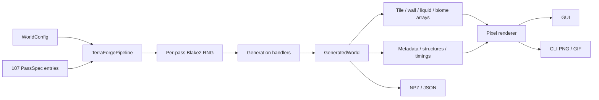

# TerraForge architecture

TerraForge is a deterministic grid simulation with three surfaces: Python API,
CLI, and a native Tk desktop application. All three call the same pipeline and
renderer.

## Modules

| Module | Responsibility |
|---|---|
| `config.py` | Immutable settings, dimensions, and stable seed conversion. |
| `tiles.py` | The only simulation ID registry and visual styles. |
| `model.py` | Typed arrays, layer depths, structure markers, pass results. |
| `passes.py` | Public order, phases, fidelity labels, and handler routing. |
| `geometry.py` | Clipped ellipse and directed-walk primitives. |
| `generation.py` | Stateless pass handlers that receive world + local RNG. |
| `pipeline.py` | Ordering, RNG isolation, events, cancellation, snapshots, timing. |
| `render.py` | Original pixel map, overlays, symbols, and file exporters. |
| `gui.py` | Tk worker-thread UI over the shared API. |
| `cli.py` | Generate, pass inventory, benchmark, and GUI commands. |

## Invariants

### Determinism

`WorldConfig.seed_value` is a stable unsigned 32-bit value. The pipeline hashes
that value with each pass name and creates an independent NumPy generator. A
new random draw in `Dungeon` cannot shift `Living Trees` or any later pass.

### Data separation

`GeneratedWorld` stores `uint8` tile IDs, walls, liquid amounts, liquid kinds,
and biomes in distinct arrays plus an `int16` surface profile. A wall or liquid
can coexist with an air tile without overloading one integer registry.

### Honest pass accounting

All 107 entries always emit telemetry. Disabled phase passes remain in results
with an explanatory note. A pass with no unique grid operation is labeled
`documented`; shared/simplified logic is `approximated`.

### Thread ownership

Generation may run off the GUI thread, but Tk widgets are only touched by the
main thread. The worker places typed events in a queue; cancellation is checked
between passes.

## Extension path

To add a new modeled behavior, write a handler accepting `(world, rng)`, route
it from `passes.py`, add a deterministic test, and update the fidelity inventory.
Avoid dependencies on render/GUI code from generation modules.
