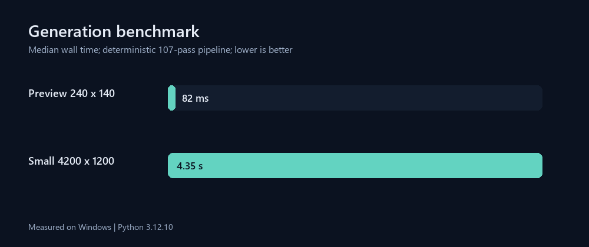

# Benchmarks

TerraForge benchmarks generation only: no PNG/GIF rendering, compression, or
GUI startup. The tracked samples were recorded on Windows 11 with Python 3.12.

| Scale | Dimensions | Iterations | Median |
|---|---:|---:|---:|
| Preview | 240 x 140 | 7 | 0.082 s |
| Small | 4200 x 1200 | 3 | 4.35 s |



Raw samples and the exact platform string are stored in
[`media/benchmarks.json`](media/benchmarks.json). Timing naturally varies with
CPU, power plan, Python, NumPy, and background load.

## Reproduce

Quick CLI measurements:

```bash
terraforge benchmark --scale preview --iterations 7
terraforge benchmark --scale small --iterations 3
```

Regenerate the tracked chart and JSON (this also regenerates README media):

```bash
python -m scripts.generate_media
```

## Performance design

- World state uses compact typed NumPy arrays rather than Python object cells.
- Broad terrain and render operations are vectorized.
- Geometry stamps clip to small local views rather than allocating world-size
  masks for every cave or ore vein.
- Preview is the default for interactive work; Small is a deliberate request.
- Renderer dependencies are excluded from the Windows executable when unused.

The previous Small generator measured roughly 6.6 seconds during the audit on
the same development machine. TerraForge's measured 4.35-second median is about
34% faster while executing the complete named pass catalogue. Treat that as a
local before/after observation, not a cross-machine promise.
