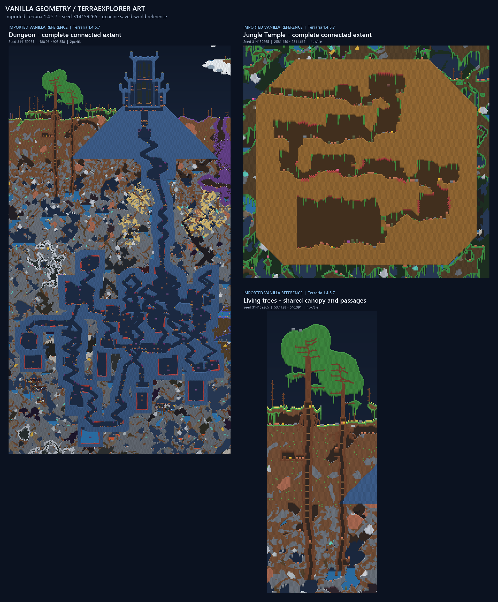

# Canonical import and vanilla reference renders

**Milestone complete:** the genuine Terraria **1.4.5.7 / BuildID 24825745** oracle imports without loss of the supported serialized cell fields. Dungeon, Jungle Temple and living-tree reference crops now use **vanilla saved geometry with TerraExplorer's existing original art style**. No world-generation implementation was changed. Observed 14 September 2026 UTC.



The sheet shows the entire connected Dungeon material extent, Temple and shared living-tree group. Every image comes from the same genuine `.wld`; no TerraExplorer-generated structure is substituted. Context around structures is also imported from that world.

## Fixture and lossless state

Input: [runtime oracle Run 1](../../audit/runtime-oracle-20260914/run-1/bootstrap-small.wld), **3,011,311 bytes**, SHA-256 `cae384ddc3466ca80f398912797b3dbbe241972653067c306b96142719551a8e`. Recovered format **325**, **4200 × 1200**, **Classic / 0**, **Corruption**, seed **314159265**, pre-Hardmode. The original target lock and both oracle files are unchanged.

The [canonical schema](CANONICAL_SCHEMA.md) documents every field, width, bit meaning and pinned serializer source. The internal representation is an immutable **16-byte cell record** with uint16 native tile/wall IDs, int16 saved frames, presence, liquid amount/type, shape/half-block, four wires, actuator/inactive, paints and visibility/fullbright coatings. Frame presence comes from the retained per-file importance table. `cells[y, x]` is a read-only NumPy view; canonical byte order remains x-major then y. Imported state never enters the simplified simulation tile registry.

All **5,040,000 cells / 80,640,000 expanded bytes** reproduce the previous semantic SHA-256 exactly:

`97d590a10019a682b04bdbf076c70b18f8f557fc9c6c0ce3964158994eac9b4c`

The live `decode_tiles` function's AST is identical to the pre-promotion implementation. Tests independently ran that preserved historical decoder and compared every semantic field. There is no new hash scheme. The importer also reconstructs the original `.wld` bytes exactly from its retained sections/preamble. Synthetic tests preserve unknown native IDs **60000 / 50000**, extreme signed frames, paints, all flags and encoded zero-amount shimmer; unknown IDs never become air.

The decoder validates version, Small dimensions, section pointers, frame-importance data, complete RLE/cell consumption and footer consistency. Truncated, malformed and unsupported files fail explicitly. It remains a bounded **Small/version-325 importer**, not an editor or general gameplay loader.

Python entry point:

```python
from terraexplorer.fidelity.world import import_world
world = import_world("audit/runtime-oracle-20260914/run-1/bootstrap-small.wld")
native_tile = world.cells[208, 741]["tile"]
```

## Structure extraction and measured extent

All bounds below are **half-open native cell coordinates** `[left, top, right, bottom]`. A *support cell* has an active native structure-family tile **or** a structure-family wall. Counts on support include objects standing against those walls. Separate crop histograms include surrounding context; they are not mislabeled as structure-owned material.

| Structure | Tight support bounds | Width × height | Support cells | Active on support | Walls on support | Saved-frame cells |
|---|---|---:|---:|---:|---:|---:|
| Dungeon | `[500,108,891,846]` | 391 × 738 | 114,664 | 75,055 | 111,178 | 2,716 |
| Jungle Temple | `[2593,462,2799,655]` | 206 × 193 | 37,224 | 27,384 | 36,508 | 502 |
| Living-tree group | `[549,140,628,379]` | 79 × 239 | 6,514 | 5,543 | 2,969 | 120 |

**Dungeon:** scan the full world for active bricks/cracked bricks **41,43,44,481,482,483** or unsafe Dungeon walls **7,8,9,94–99**. Extract exact 4-neighbor components and anchor the brick/wall component to metadata entrance **(741,208)**. The entrance lies directly on its support (distance zero). This fixture has one component, containing **66,462 green bricks (43)** and **3,877 cracked green bricks (482)**. Bounds include the surface building, broad brick foundation, descending passage and deep branches; they were not selected as a convenient crop.

**Temple:** extract 4-neighbor components of active Lihzahrd brick **226** or unsafe wall **87**, then require the connected brick/wall region to contain altar **237**. The single resulting component has **26,115 bricks** and the six saved altar cells at **`[2678,632,2681,634]`**. Neither the project's previous Temple envelope nor a manually chosen rectangle determines these bounds.

**Living trees:** scan active living wood **191**, leaves **192**, and walls **78/244**, then associate through 8-neighbor connectivity. Require wood, leaves and unsafe living-wood wall together. One group contains **2,622 wood** and **2,798 leaf cells**. Five disconnected wood-only components become associated through foliage and walls; the combined support is also 4-connected in this fixture. Three other wall-only candidates (97, 46 and 56 cells) fail these criteria and are recorded explicitly rather than being counted as surface living trees. Underground mahogany IDs 383/384 are outside this LivingTrees-family extraction.

The group has **two candidate stems**. Their detection uses vertical wood runs within the foliage's Y extent, with threshold `max(8, ceil(canopy_height/4))`, here **20 cells**. Consecutive qualifying columns produce bands **[573,578)** and **[607,610)**, centers **575** and **608**, maximum runs **52** and **26**. The full canopy is `[550,140,628,219]`. For individual views, support is associated with the nearest stem-center X (ties left): **3,730** and **2,784** cells. Their derived bounds are `[549,140,592,379]` and `[592,144,628,375]`. This split is a documented measurement/display heuristic; exact ownership of merged canopies and passages cannot be recovered as generation history from the save. The complete group is retained as the primary reference.

[Machine-readable statistics](reference_renders/structure_statistics.json) include all bounds, native tile/wall histograms, connectivity, liquid kinds, frame counts, rejected candidates, stem associations and render provenance. Empty wall-backed cell components number **53 / 18 / 35** for Dungeon / Temple / trees. These are precisely 4-connected cells with `active=0` and a nonzero wall on support; furniture/platforms can split them. They are **not** claimed to be room counts or traversable player paths. Liquid-bearing support counts are **824 / 0 / 40**. Separate root/branch ownership and original generation write bounds remain unrecovered.

The extraction rules were checked against pinned `TileID.cs` / `WallID.cs`, `LegacyDungeonRoom.cs:260-301`, and `WorldGen.cs` Temple cleaner/brick/altar spans plus the `GrowLivingTree` wood, leaf, wall, passage and room spans. Source paths, exact excerpts and fresh hashes are in the [verification evidence](../../audit/canonical-import-20260914/verification.json). These source methods were **inspected**, not reimplemented or run separately.

## Render outputs and art boundary

- [Dungeon overview](reference_renders/dungeon_1.png), 2 pixels per native tile.
- [Dungeon entrance detail](reference_renders/dungeon_entrance.png), 4 pixels per tile. Its metadata-centered 192 × 192 display window is explicitly separate from detected extent.
- [Jungle Temple](reference_renders/temple_1.png), 4 pixels per tile.
- [Full living-tree group](reference_renders/living_tree_group_1.png), [tree 1 association](reference_renders/living_tree_stem_1.png), [tree 2 association](reference_renders/living_tree_stem_2.png), 4 pixels per tile.
- [Combined sheet](reference_renders/comparison_sheet.png).

Overviews add 12 context cells around detected support; individual stem views add 8. This is presentation padding, not an extraction rule. Each image carries an imported-vanilla label. JSON records source `.wld` and expanded-cell hashes, exact crop coordinates, crop cell hash, unlabelled RGB hash, PNG hash and unsupported IDs. All **seven PNGs reproduced byte-identically** in a fresh output directory and were visually inspected, including entrance and individual tree views.

**Authentic:** saved positions, native material identity, occupancy, wall extent, encoded half/slope shape, liquids and all retained state. **Approximate/original art:** TerraExplorer palette colors, coordinate texture, edge lighting, material mapping, amount-dependent liquid blending and ghosting of inactive/invisible blocks. Frames are preserved but not rendered as proprietary sprites; paint, wall visibility and fullbright do not currently change the view. Furniture uses its saved occupied cells, not detailed sprite silhouettes. Unknown IDs use deterministic fallback colors. No Re-Logic graphics or existing art assets were changed or redistributed.

## Changes, commands and verification

Added `terraexplorer/fidelity/{__init__,wld325,world,structures,render}.py`, [reference export command](../../scripts/render_vanilla_references.py), [canonical tests](../../tests/test_canonical_import.py), this report, the schema document, seven PNGs and compact statistics JSON. Changed only the earlier [audit reader script](../../scripts/fidelity_wld325.py) into a compatibility wrapper around the promoted decoder. No unrelated public API or GUI adapter was needed.

Actually executed:

```powershell
python scripts/render_vanilla_references.py audit/runtime-oracle-20260914/run-1/bootstrap-small.wld --output docs/fidelity/reference_renders
python audit/canonical-import-20260914/verify.py
```

The verification helper records the exact commands, cwd, stdout/stderr, exit codes and timings. It ran **21 passing tests** across `test_fidelity_wld325.py` and `test_canonical_import.py`, Ruff lint/format checks, mypy on the new package, the preserved audit CLI comparing both genuine worlds, and a fresh reference export. It verified identical decoder AST, matching source/palette constants, all 29 pinned hashes, **161 unchanged prior files**, and reproduction of every PNG. Its only expected prior-file change is the promoted reader's wrapper. The full application test suite, GUI and TerrariaServer were **not** run in this milestone; saved oracle data was read directly.

The root brief, earlier reports, target lock, raw corpus, existing art/GUI, procedural terrain/Dungeon/Temple/trees, RNG and pass catalogue remain untouched. Existing uncommitted work is preserved. Nothing was staged, committed, installed or published. The milestone stops at canonical importing, measured extraction and reference visualization; independent generation and seed parity remain outside this work.
